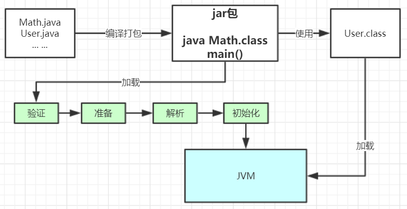
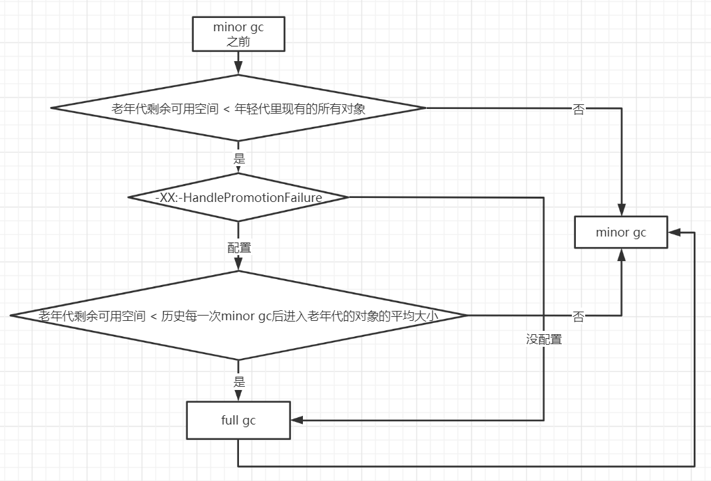

# JVM调优-1类加载机制和JVM整体结构

## 类加载过程

当使用java运行一个main函数的时候，首先需要通过**类加载器**把主类加载到JVM。

```java
package com.example.test;

public class Math {
    public static final int initData = 666;
    public static User user = new User();

    public int compute() {  //一个方法对应一块栈帧内存区域
        int a = 1;
        int b = 2;
        int c = (a + b) * 10;
        return c;
    }

    public static void main(String[] args) {
        Math math = new Math();
        math.compute();
    }
}
```

通过java命令执行代码的大体流程如下：


### 类加载的步骤

其中loadClass的类加载过程有如下几步：

**加载 >> 验证 >> 准备 >> 解析 >> 初始化 >>** 使用 >> 卸载

- 加载：在硬盘上查找并通过IO读入字节码文件，使用到类时才会加载，例如调用类的main()方法，new对象等等，在加载阶段会在内存中生成一个**代表这个类的java.lang.Class对象**，作为方法区这个类的各种数据的访问入口
- 验证：校验字节码文件的正确性
- 准备：给类的静态变量分配内存，并赋予默认值
- 解析：将**符号引用**替换为直接引用，该阶段会把一些静态方法(符号引用，比如main()方法)替换为指向数据所存内存的指针或句柄等(直接引用)，这是所谓的**静态链接**过程(类加载期间完成)，**动态链接**是在程序运行期间完成的将符号引用替换为直接引用，下节课会讲到动态链接
- **初始化**：对类的静态变量初始化为指定的值，执行静态代码块



类被加载到方法区中后主要包含 **运行时常量池、类型信息、字段信息、方法信息、类加载器的引用、对应class实例的引用**等信息。

**类加载器的引用**：这个类到类加载器实例的引用

**对应class实例的引用**：类加载器在加载类信息放到方法区中后，会创建一个对应的Class 类型的对象实例放到堆(Heap)中, 作为开发人员访问方法区中类定义的入口和切入点。

**注意，**主类在运行过程中如果使用到其它类，会逐步加载这些类。

jar包或war包里的类不是一次性全部加载的，是使用到时才加载。


## 类加载器和双亲委派机制

### 类加载机制

上面的类加载过程主要是通过类加载器来实现的，Java里有如下几种类加载器

- 引导类加载器：负责加载支撑JVM运行的位于JRE的lib目录下的核心类库，比如rt.jar、charsets.jar等
- 扩展类加载器：负责加载支撑JVM运行的位于JRE的lib目录下的ext扩展目录中的JAR类包
- 应用程序类加载器：负责加载ClassPath路径下的类包，主要就是加载你自己写的那些类
- 自定义加载器：负责加载用户自定义路径下的类包

eg:

```java
public class TestJDKClassLoader {

    public static void main(String[] args) {
        System.out.println(String.class.getClassLoader());
        System.out.println(com.sun.crypto.provider.DESKeyFactory.class.getClassLoader().getClass().getName());
        System.out.println(TestJDKClassLoader.class.getClassLoader().getClass().getName());

        System.out.println();
        ClassLoader appClassLoader = ClassLoader.getSystemClassLoader();
        ClassLoader extClassloader = appClassLoader.getParent();
        ClassLoader bootstrapLoader = extClassloader.getParent();
        System.out.println("the bootstrapLoader : " + bootstrapLoader);
        System.out.println("the extClassloader : " + extClassloader);
        System.out.println("the appClassLoader : " + appClassLoader);

        System.out.println();
        System.out.println("bootstrapLoader加载以下文件：");
        URL[] urls = Launcher.getBootstrapClassPath().getURLs();
        for (int i = 0; i < urls.length; i++) {
            System.out.println(urls[i]);
        }

        System.out.println();
        System.out.println("extClassloader加载以下文件：");
        System.out.println(System.getProperty("java.ext.dirs"));

        System.out.println();
        System.out.println("appClassLoader加载以下文件：");
        System.out.println(System.getProperty("java.class.path"));
    }
}

运行结果：
null
sun.misc.Launcher$ExtClassLoader
sun.misc.Launcher$AppClassLoader

the bootstrapLoader : null
the extClassloader : sun.misc.Launcher$ExtClassLoader@3af49f1c
the appClassLoader : sun.misc.Launcher$AppClassLoader@18b4aac2

bootstrapLoader加载以下文件：
file:/C:/Program%20Files/Java/jdk1.8.0_191/jre/lib/resources.jar
file:/C:/Program%20Files/Java/jdk1.8.0_191/jre/lib/rt.jar
file:/C:/Program%20Files/Java/jdk1.8.0_191/jre/lib/sunrsasign.jar
file:/C:/Program%20Files/Java/jdk1.8.0_191/jre/lib/jsse.jar
file:/C:/Program%20Files/Java/jdk1.8.0_191/jre/lib/jce.jar
file:/C:/Program%20Files/Java/jdk1.8.0_191/jre/lib/charsets.jar
file:/C:/Program%20Files/Java/jdk1.8.0_191/jre/lib/jfr.jar
file:/C:/Program%20Files/Java/jdk1.8.0_191/jre/classes

extClassloader加载以下文件：
C:\Program Files\Java\jdk1.8.0_191\jre\lib\ext;C:\WINDOWS\Sun\Java\lib\ext

appClassLoader加载以下文件：
C:\Program Files\Java\jdk1.8.0_191\jre\lib\charsets.jar;C:\Program Files\Java\jdk1.8.0_191\jre\lib\deploy.jar;C:\Program Files\Java\jdk1.8.0_191\jre\lib\ext\access-bridge-64.jar;C:\Program Files\Java\jdk1.8.0_191\jre\lib\ext\cldrdata.jar;C:\Program Files\Java\jdk1.8.0_191\jre\lib\ext\dnsns.jar;C:\Program Files\Java\jdk1.8.0_191\jre\lib\ext\jaccess.jar;C:\Program Files\Java\jdk1.8.0_191\jre\lib\ext\jfxrt.jar;C:\Program Files\Java\jdk1.8.0_191\jre\lib\ext\localedata.jar;C:\Program Files\Java\jdk1.8.0_191\jre\lib\ext\nashorn.jar;C:\Program Files\Java\jdk1.8.0_191\jre\lib\ext\sunec.jar;C:\Program Files\Java\jdk1.8.0_191\jre\lib\ext\sunjce_provider.jar;C:\Program Files\Java\jdk1.8.0_191\jre\lib\ext\sunmscapi.jar;C:\Program Files\Java\jdk1.8.0_191\jre\lib\ext\sunpkcs11.jar;C:\Program Files\Java\jdk1.8.0_191\jre\lib\ext\zipfs.jar;C:\Program  ... ... ... ...
```

### 类加载器初始化过程

参见类运行加载全过程图可知其中会创建JVM启动器实例sun.misc.Launcher。

在Launcher构造方法内部，其创建了两个类加载器，分别是sun.misc.Launcher.ExtClassLoader(扩展类加载器)和sun.misc.Launcher.AppClassLoader(应用类加载器)。

JVM默认使用Launcher的getClassLoader()方法返回的类加载器AppClassLoader的实例加载我们的应用程序。

```java
//Launcher的构造方法
public Launcher() {
    Launcher.ExtClassLoader var1;
    try {
        //构造扩展类加载器，在构造的过程中将其父加载器设置为null
        var1 = Launcher.ExtClassLoader.getExtClassLoader();
    } catch (IOException var10) {
        throw new InternalError("Could not create extension class loader", var10);
    }

    try {
        //构造应用类加载器，在构造的过程中将其父加载器设置为ExtClassLoader，
        //Launcher的loader属性值是AppClassLoader，我们一般都是用这个类加载器来加载我们自己写的应用程序
        this.loader = Launcher.AppClassLoader.getAppClassLoader(var1);
    } catch (IOException var9) {
        throw new InternalError("Could not create application class loader", var9);
    }

    Thread.currentThread().setContextClassLoader(this.loader);
    String var2 = System.getProperty("java.security.manager");
    ... ... //省略一些不需关注代码

}
```

### 双亲委派机制


JVM类加载器是有亲子层级结构的，这里类加载其实就有一个**双亲委派机制**，加载某个类时会先委托父加载器寻找目标类，找不到再委托上层父加载器加载，如果所有父加载器在自己的加载类路径下都找不到目标类，则在自己的类加载路径中查找并载入目标类。

比如刚刚的Math类，最先会找应用程序类加载器加载，应用程序类加载器会先委托扩展类加载器加载，扩展类加载器再委托引导类加载器，顶层引导类加载器在自己的类加载路径里找了半天没找到Math类，则向下退回加载Math类的请求，扩展类加载器收到回复就自己加载，在自己的类加载路径里找了半天也没找到Math类，又向下退回Math类的加载请求给应用程序类加载器，应用程序类加载器于是在自己的类加载路径里找Math类，结果找到了就自己加载了。。

**双亲委派机制说简单点就是，先找父亲加载，不行再由儿子自己加载**

### AppClassLoader的双亲委派机制

来看下应用程序类加载器AppClassLoader加载类的双亲委派机制源码，AppClassLoader的loadClass方法最终会调用其父类ClassLoader的loadClass方法，该方法的大体逻辑如下：

1. 首先，检查一下指定名称的类是否已经加载过，如果加载过了，就不需要再加载，直接返回。
2. 如果此类没有加载过，那么，再判断一下是否有父加载器；如果有父加载器，则由父加载器加载（即调用parent.loadClass(name, false);）.或者是调用bootstrap类加载器来加载。
3. 如果父加载器及bootstrap类加载器都没有找到指定的类，那么调用当前类加载器的findClass方法来完成类加载。

```java
//ClassLoader的loadClass方法，里面实现了双亲委派机制
protected Class<?> loadClass(String name, boolean resolve)
    throws ClassNotFoundException
{
    synchronized (getClassLoadingLock(name)) {
        // 检查当前类加载器是否已经加载了该类
        Class<?> c = findLoadedClass(name);
        if (c == null) {
            long t0 = System.nanoTime();
            try {
                if (parent != null) {  //如果当前加载器父加载器不为空则委托父加载器加载该类
                    c = parent.loadClass(name, false);
                } else {  //如果当前加载器父加载器为空则委托引导类加载器加载该类
                    c = findBootstrapClassOrNull(name);
                }
            } catch (ClassNotFoundException e) {
                // ClassNotFoundException thrown if class not found
                // from the non-null parent class loader
            }

            if (c == null) {
                // If still not found, then invoke findClass in order
                // to find the class.
                long t1 = System.nanoTime();
                //都会调用URLClassLoader的findClass方法在加载器的类路径里查找并加载该类
                c = findClass(name);

                // this is the defining class loader; record the stats
                sun.misc.PerfCounter.getParentDelegationTime().addTime(t1 - t0);
                sun.misc.PerfCounter.getFindClassTime().addElapsedTimeFrom(t1);
                sun.misc.PerfCounter.getFindClasses().increment();
            }
        }
        if (resolve) {  //不会执行
            resolveClass(c);
        }
        return c;
    }
}
```

#### 双亲委派机制的目的

- 沙箱安全机制：自己写的java.lang.String.class类不会被加载，这样便可以防止核心API库被随意篡改
- 避免类的重复加载：当父亲已经加载了该类时，就没有必要子ClassLoader再加载一次，保证**被加载类的唯一性**

#### 全盘负责委托机制

**"全盘负责"是指当一个ClassLoder装载一个类时，除非显示的使用另外一个ClassLoder，该类所依赖及引用的类也由这个ClassLoder载入。**

**自定义类加载器示例：**

自定义类加载器只需要继承 java.lang.ClassLoader 类，该类有两个核心方法，一个是loadClass(String, boolean)，实现了**双亲委派机制**，还有一个方法是findClass，默认实现是空方法，所以我们自定义类加载器主要是**重写findClass方法**。

```java
public class MyClassLoaderTest {
    static class MyClassLoader extends ClassLoader {
        private String classPath;

        public MyClassLoader(String classPath) {
            this.classPath = classPath;
        }

        private byte[] loadByte(String name) throws Exception {
            name = name.replaceAll("\\.", "/");
            FileInputStream fis = new FileInputStream(classPath + "/" + name
                    + ".class");
            int len = fis.available();
            byte[] data = new byte[len];
            fis.read(data);
            fis.close();
            return data;
        }

        protected Class<?> findClass(String name) throws ClassNotFoundException {
            try {
                byte[] data = loadByte(name);
                //defineClass将一个字节数组转为Class对象，这个字节数组是class文件读取后最终的字节数组。
                return defineClass(name, data, 0, data.length);
            } catch (Exception e) {
                e.printStackTrace();
                throw new ClassNotFoundException();
            }
        }

    }

    public static void main(String args[]) throws Exception {
        //初始化自定义类加载器, 会先初始化父类ClassLoader, 其中会把自定义类加载器的父加载器设置为应用程序类加载器AppClassLoader
        MyClassLoader classLoader = new MyClassLoader("D:/test");
        //D盘创建 test/com/example/test 几级目录，将User类的复制类User1.class丢入该目录
        Class clazz = classLoader.loadClass("com.test.jvm.User1");
        Object obj = clazz.newInstance();
        Method method = clazz.getDeclaredMethod("sout", null);
        method.invoke(obj, null);
        System.out.println(clazz.getClassLoader().getClass().getName());
    }
}

运行结果：
=======自己的加载器加载类调用方法=======
com.example.test.MyClassLoaderTest$MyClassLoader
```

### 打破双亲委派机制

再来一个沙箱安全机制示例，尝试打破双亲委派机制，用自定义类加载器加载我们自己实现的 java.lang.String.class

```java
public class MyClassLoaderTest {
    static class MyClassLoader extends ClassLoader {
        private String classPath;

        public MyClassLoader(String classPath) {
            this.classPath = classPath;
        }

        private byte[] loadByte(String name) throws Exception {
            name = name.replaceAll("\\.", "/");
            FileInputStream fis = new FileInputStream(classPath + "/" + name
                    + ".class");
            int len = fis.available();
            byte[] data = new byte[len];
            fis.read(data);
            fis.close();
            return data;

        }

        protected Class<?> findClass(String name) throws ClassNotFoundException {
            try {
                byte[] data = loadByte(name);
                return defineClass(name, data, 0, data.length);
            } catch (Exception e) {
                e.printStackTrace();
                throw new ClassNotFoundException();
            }
        }

        /**
         * 重写类加载方法, 实现自己的加载逻辑, 不委派给双亲加载
         */
        protected Class<?> loadClass(String name, boolean resolve)
                throws ClassNotFoundException {
            synchronized (getClassLoadingLock(name)) {
                // First, check if the class has already been loaded
                Class<?> c = findLoadedClass(name);
                if (c == null) {
                    // If still not found, then invoke findClass in order
                    // to find the class.
                    long t1 = System.nanoTime();
                    c = findClass(name);

                    // this is the defining class loader; record the stats
                    sun.misc.PerfCounter.getFindClassTime().addElapsedTimeFrom(t1);
                    sun.misc.PerfCounter.getFindClasses().increment();
                }
                if (resolve) {
                    resolveClass(c);
                }
                return c;
            }
        }
    }

    public static void main(String args[]) throws Exception {
        MyClassLoader classLoader = new MyClassLoader("D:/test");
        //尝试用自己改写类加载机制去加载自己写的java.lang.String.class
        Class clazz = classLoader.loadClass("java.lang.String");
        Object obj = clazz.newInstance();
        Method method= clazz.getDeclaredMethod("sout", null);
        method.invoke(obj, null);
        System.out.println(clazz.getClassLoader().getClass().getName());
    }
}

运行结果：
java.lang.SecurityException: Prohibited package name: java.lang
	at java.lang.ClassLoader.preDefineClass(ClassLoader.java:659)
	at java.lang.ClassLoader.defineClass(ClassLoader.java:758)
```

### Hotspot源码JVM启动执行main方法流程


## JVM整体结构及内存模型


### JVM整体结构


#### 方法区

需要搞清楚方法区、永久代、元空间三个名词之间的关系

方法区是规范，永久代、元空间是具体实现。或者说，方法区是Java中的接口，永久代、元空间是Java中接口的实现类。

再说下永久代、元空间之间的区别

永久代：jdk8之前方法区的实现，在堆中，用于存放类的元信息，及InstanceKlass类的实例

元空间：jdk8及之后方法区的实现，在OS内存中，用于存放类的元信息

#### 虚拟机栈

JVM是软件模拟的虚拟机，基于栈运行

虚拟机栈中又有很多栈帧，栈帧又被分成了其他区域。理解虚拟机栈的核心就是理解栈帧中的这几个区域

* 局部变量表
* 操作数栈
* 动态链接
* 返回地址
* 附加信息

#### 堆区

内存模型中最核心的区域，也是JVM调优重点关注的区域


#### 本地方法栈

JAVA通过JNI调用C、C++动态链接库需要的栈，随着socket的发展，JNI技术已经用得非常非常少。


### jvm参数

Spring Boot程序的JVM参数设置格式(Tomcat启动直接加在bin目录下catalina.sh文件里)：

```shell
java -Xms2048M -Xmx2048M -Xmn1024M -Xss512K -XX:MetaspaceSize=256M -XX:MaxMetaspaceSize=256M -jar hust-web.jar
```

#### 常见参数

-Xss：每个线程的栈大小

-Xms：初始堆大小，默认物理内存的1/64

-Xmx：最大堆大小，默认物理内存的1/4

-Xmn：新生代大小

-XX:NewSize：设置新生代初始大小

-XX:NewRatio：默认2表示新生代占年老代的1/2，占整个堆内存的1/3。

-XX:SurvivorRatio：默认8表示一个survivor区占用1/8的Eden内存，即1/10的新生代内存。

关于元空间的JVM参数有两个：-XX:MetaspaceSize=N和 -XX:MaxMetaspaceSize=N

**-XX：MaxMetaspaceSize**： 设置元空间最大值， 默认是-1， 即不限制， 或者说只受限于本地内存大小。

**-XX：MetaspaceSize**： 指定元空间触发Fullgc的初始阈值(元空间无固定初始大小)， 以字节为单位，默认是21M，达到该值就会触发full gc进行类型卸载， 同时收集器会对该值进行调整： 如果释放了大量的空间， 就适当降低该值； 如果释放了很少的空间， 那么在不超过-XX：MaxMetaspaceSize（如果设置了的话） 的情况下， 适当提高该值。这个跟早期jdk版本的**-XX:PermSize**参数意思不一样，-**XX:PermSize**代表永久代的初始容量。

由于调整元空间的大小需要Full GC，这是非常昂贵的操作，如果应用在启动的时候发生大量Full GC，通常都是由于永久代或元空间发生了大小调整，基于这种情况，一般建议在JVM参数中将MetaspaceSize和MaxMetaspaceSize设置成一样的值，并设置得比初始值要大，对于8G物理内存的机器来说，一般我会将这两个值都设置为256M。

#### 更多参数

java参数可以通过 java命令查看

#### 标准参数

```shell
PS C:\Users\3000> java -help
用法: java [-options] class [args...]
           (执行类)
   或  java [-options] -jar jarfile [args...]
           (执行 jar 文件)
其中选项包括:
    -d32          使用 32 位数据模型 (如果可用)
    -d64          使用 64 位数据模型 (如果可用)
    -server       选择 "server" VM
                  默认 VM 是 server.

    -cp <目录和 zip/jar 文件的类搜索路径>
    -classpath <目录和 zip/jar 文件的类搜索路径>
                  用 ; 分隔的目录, JAR 档案
                  和 ZIP 档案列表, 用于搜索类文件。
    -D<名称>=<值>
                  设置系统属性
    -verbose:[class|gc|jni]
                  启用详细输出
    -version      输出产品版本并退出
    -version:<值>
                  警告: 此功能已过时, 将在
                  未来发行版中删除。
                  需要指定的版本才能运行
    -showversion  输出产品版本并继续
    -jre-restrict-search | -no-jre-restrict-search
                  警告: 此功能已过时, 将在
                  未来发行版中删除。
                  在版本搜索中包括/排除用户专用 JRE
    -? -help      输出此帮助消息
    -X            输出非标准选项的帮助
    -ea[:<packagename>...|:<classname>]
    -enableassertions[:<packagename>...|:<classname>]
                  按指定的粒度启用断言
    -da[:<packagename>...|:<classname>]
    -disableassertions[:<packagename>...|:<classname>]
                  禁用具有指定粒度的断言
    -esa | -enablesystemassertions
                  启用系统断言
    -dsa | -disablesystemassertions
                  禁用系统断言
    -agentlib:<libname>[=<选项>]
                  加载本机代理库 <libname>, 例如 -agentlib:hprof
                  另请参阅 -agentlib:jdwp=help 和 -agentlib:hprof=help
    -agentpath:<pathname>[=<选项>]
                  按完整路径名加载本机代理库
    -javaagent:<jarpath>[=<选项>]
                  加载 Java 编程语言代理, 请参阅 java.lang.instrument
    -splash:<imagepath>
                  使用指定的图像显示启动屏幕
有关详细信息, 请参阅 http://www.oracle.com/technetwork/java/javase/documentation/index.html。
```

#### 非标准参数

```shell
PS C:\Users\3000> java -X
    -Xmixed           混合模式执行 (默认)
    -Xint             仅解释模式执行
    -Xbootclasspath:<用 ; 分隔的目录和 zip/jar 文件>
                      设置搜索路径以引导类和资源
    -Xbootclasspath/a:<用 ; 分隔的目录和 zip/jar 文件>
                      附加在引导类路径末尾
    -Xbootclasspath/p:<用 ; 分隔的目录和 zip/jar 文件>
                      置于引导类路径之前
    -Xdiag            显示附加诊断消息
    -Xnoclassgc       禁用类垃圾收集
    -Xincgc           启用增量垃圾收集
    -Xloggc:<file>    将 GC 状态记录在文件中 (带时间戳)
    -Xbatch           禁用后台编译
    -Xms<size>        设置初始 Java 堆大小
    -Xmx<size>        设置最大 Java 堆大小
    -Xss<size>        设置 Java 线程堆栈大小
    -Xprof            输出 cpu 配置文件数据
    -Xfuture          启用最严格的检查, 预期将来的默认值
    -Xrs              减少 Java/VM 对操作系统信号的使用 (请参阅文档)
    -Xcheck:jni       对 JNI 函数执行其他检查
    -Xshare:off       不尝试使用共享类数据
    -Xshare:auto      在可能的情况下使用共享类数据 (默认)
    -Xshare:on        要求使用共享类数据, 否则将失败。
    -XshowSettings    显示所有设置并继续
    -XshowSettings:all
                      显示所有设置并继续
    -XshowSettings:vm 显示所有与 vm 相关的设置并继续
    -XshowSettings:properties
                      显示所有属性设置并继续
    -XshowSettings:locale
                      显示所有与区域设置相关的设置并继续

-X 选项是非标准选项, 如有更改, 恕不另行通知。
```

#### 不稳定参数(会对系统造成影响,谨慎使用,之后的版本可能放弃)

```shell
java -XX:+PrintFlagsFinal and -XX:+PrintFlagsInitial
java -XX:+PrintFlagsInitial  -XX:+PrintFlagsInitial>>1.txt  # 也可以输入txt文本
```

非State参数非常的多，这里只介绍比较常用的，Java HotSpot VM中-XX:的可配置参数列表进行描述；

这些参数可以被松散的聚合成三类：

行为参数(Behavioral Options)：用于改变jvm的一些基础行为；

性能调优(Performance Tuning)：用于jvm的性能调优；

调试参数(Debugging Options)：一般用于打开跟踪、打印、输出等jvm参数，用于显示jvm更加详细的信息；

```shell
行为参数(功能开关)
-XX:-DisableExplicitGC  # 禁止调用System.gc()；但jvm的gc仍然有效
-XX:+MaxFDLimit  # 最大化文件描述符的数量限制
-XX:+ScavengeBeforeFullGC  # 新生代GC优先于Full GC执行
-XX:+UseGCOverheadLimit  # 在抛出OOM之前限制jvm耗费在GC上的时间比例
-XX:-UseConcMarkSweepGC  # 对老生代采用并发标记交换算法进行GC
-XX:-UseParallelGC  # 启用并行GC
-XX:-UseParallelOldGC  # 对Full GC启用并行，当-XX:-UseParallelGC启用时该项自动启用
-XX:-UseSerialGC  # 启用串行GC
-XX:-UseG1GC  # 启用G1 GC
-XX:+UseThreadPriorities  # 启用本地线程优先级

性能调优
-XX:LargePageSizeInBytes=4m  # 设置用于Java堆的大页面尺寸
-XX:MaxHeapFreeRatio=70  # GC后java堆中空闲量占的最大比例
-XX:MaxNewSize=size  # 新生成对象能占用内存的最大值
-XX:MaxPermSize=64m  # 老生代对象能占用内存的最大值
-XX:MinHeapFreeRatio=40  # GC后java堆中空闲量占的最小比例
-XX:NewRatio=2  # 新生代内存容量与老生代内存容量的比例
-XX:NewSize=2.125m  # 新生代对象生成时占用内存的默认值
-XX:ReservedCodeCacheSize=32m  # 保留代码占用的内存容量
-XX:ThreadStackSize=512  # 设置线程栈大小,若为0则使用系统默认值
-XX:+UseLargePages  # 使用大页面内存

调试参数
-XX:-CITime  # 打印消耗在JIT编译的时间
-XX:ErrorFile=./hs_err_pid<pid>.log  # 保存错误日志或者数据到文件中
-XX:-ExtendedDTraceProbes  # 开启solaris特有的dtrace探针
-XX:HeapDumpPath=./java_pid<pid>.hprof  # 指定导出堆信息时的路径或文件名
-XX:-HeapDumpOnOutOfMemoryError  # 当首次遭遇OOM时导出此时堆中相关信息
-XX:OnError="<cmd args>;<cmd args>"  # 出现致命ERROR之后运行自定义命令
-XX:OnOutOfMemoryError="<cmd args>;<cmd args>"  # 当首次遭遇OOM时执行自定义命令
-XX:-PrintClassHistogram  # 遇到Ctrl-Break后打印类实例的柱状信息，与jmap -histo功能相同
-XX:-PrintConcurrentLocks  # 遇到Ctrl-Break后打印并发锁的相关信息，与jstack -l功能相同
-XX:-PrintCommandLineFlags  # 打印在命令行中出现过的标记
-XX:-PrintCompilation  # 当一个方法被编译时打印相关信息
-XX:-PrintGC  # 每次GC时打印相关信息
-XX:-PrintGC Details  # 每次GC时打印详细信息
-XX:-PrintGCTimeStamps  # 打印每次GC的时间戳
-XX:-TraceClassLoading  # 跟踪类的加载信息
-XX:-TraceClassLoadingPreorder  # 跟踪被引用到的所有类的加载信息
-XX:-TraceClassResolution  # 跟踪常量池
-XX:-TraceClassUnloading  # 跟踪类的卸载信息
-XX:-TraceLoaderConstraints  # 跟踪类加载器约束的相关信息
```

**不稳定参数类型**

##### 布尔类型

```shell
-XX:+<option> '+'表示启用该选项
-XX:+<option> '+'表示启用该选项
```

##### 数字类型

```shell
-XX:<option>=<number>
可跟随单位，例如：'m'或'M'表示兆字节;'k'或'K'千字节;'g'或'G'千兆字节。32K与32768是相同大小的。
```
##### 字符串类型

```shell
-XX:<option>=<string>
通常用于指定一个文件、路径或一系列命令列表。例如：-XX:HeapDumpPath=./dump.core
```


## JVM对象创建

### 对象的创建

对象创建的主要流程:


#### 1.类加载检查

 虚拟机遇到一条new指令时，首先将去检查这个指令的参数是否能在常量池中定位到一个类的符号引用，并且检查这个符号引用代表的类是否已被加载、解析和初始化过。如果没有，那必须先执行相应的类加载过程。

 new指令对应到语言层面上讲是，new关键词、对象克隆、对象序列化等。

#### 2.分配内存

 在类加载检查通过后，接下来虚拟机将为新生对象分配内存。对象所需内存的大小在类 加载完成后便可完全确定，为对象分配空间的任务等同于把 一块确定大小的内存从Java堆中划分出来。

这个步骤有两个问题：

1.如何划分内存。

2.在并发情况下， 可能出现正在给对象A分配内存，指针还没来得及修改，对象B又同时使用了原来的指针来分配内存的情况。

##### 划分内存的方法：

- “指针碰撞”（Bump the Pointer）(默认用指针碰撞)

如果Java堆中内存是绝对规整的，所有用过的内存都放在一边，空闲的内存放在另一边，中间放着一个指针作为分界点的指示器，那所分配内存就仅仅是把那个指针向空闲空间那边挪动一段与对象大小相等的距离。

- “空闲列表”（Free List）

如果Java堆中的内存并不是规整的，已使用的内存和空 闲的内存相互交错，那就没有办法简单地进行指针碰撞了，虚拟机就必须维护一个列表，记 录上哪些内存块是可用的，在分配的时候从列表中找到一块足够大的空间划分给对象实例， 并更新列表上的记录

##### 解决并发问题的方法：

- CAS（compare and swap）

虚拟机采用**CAS配上失败重试**的方式保证更新操作的原子性来对分配内存空间的动作进行同步处理。

- 本地线程分配缓冲（Thread Local Allocation Buffer,TLAB）

把内存分配的动作按照线程划分在不同的空间之中进行，即每个线程在Java堆中预先分配一小块内存。通过**-XX:+/-****UseTLAB**参数来设定虚拟机是否使用TLAB(JVM会默认开启**-XX:+****UseTLAB**)，-XX:TLABSize 指定TLAB大小。

#### 3.初始化零值

内存分配完成后，虚拟机需要将分配到的内存空间都初始化为零值（不包括对象头）， 如果使用TLAB，这一工作过程也可以提前至TLAB分配时进行。这一步操作保证了对象的实例字段在Java代码中可以不赋初始值就直接使用，程序能访问到这些字段的数据类型所对应的零值。

#### 4.设置对象头

初始化零值之后，虚拟机要对对象进行必要的设置，例如这个对象是哪个类的实例、如何才能找到类的元数据信息、对象的哈希码、对象的GC分代年龄等信息。这些信息存放在对象的对象头Object Header之中。

在HotSpot虚拟机中，对象在内存中存储的布局可以分为3块区域：对象头（Header）、 实例数据（Instance Data）和对齐填充（Padding）。 HotSpot虚拟机的对象头包括两部分信息，第一部分用于存储对象自身的运行时数据， 如哈希码（HashCode）、GC分代年龄、锁状态标志、线程持有的锁、偏向线程ID、偏向时 间戳等。对象头的另外一部分是类型指针，即对象指向它的类元数据的指针，虚拟机通过这个指针来确定这个对象是哪个类的实例。

##### 32位对象头


##### 64位对象头


对象头在hotspot的C++源码markOop.hpp文件里的注释如下：

```c++
// Bit-format of an object header (most significant first, big endian layout below):
//
//  32 bits:
//  --------
//             hash:25 ------------>| age:4    biased_lock:1 lock:2 (normal object)
//             JavaThread*:23 epoch:2 age:4    biased_lock:1 lock:2 (biased object)
//             size:32 ------------------------------------------>| (CMS free block)
//             PromotedObject*:29 ---------->| promo_bits:3 ----->| (CMS promoted object)
//
//  64 bits:
//  --------
//  unused:25 hash:31 -->| unused:1   age:4    biased_lock:1 lock:2 (normal object)
//  JavaThread*:54 epoch:2 unused:1   age:4    biased_lock:1 lock:2 (biased object)
//  PromotedObject*:61 --------------------->| promo_bits:3 ----->| (CMS promoted object)
//  size:64 ----------------------------------------------------->| (CMS free block)
//
//  unused:25 hash:31 -->| cms_free:1 age:4    biased_lock:1 lock:2 (COOPs && normal object)
//  JavaThread*:54 epoch:2 cms_free:1 age:4    biased_lock:1 lock:2 (COOPs && biased object)
//  narrowOop:32 unused:24 cms_free:1 unused:4 promo_bits:3 ----->| (COOPs && CMS promoted object)
//  unused:21 size:35 -->| cms_free:1 unused:7 ------------------>| (COOPs && CMS free block)
```

#### 5.执行方法

 执行方法，即对象按照程序员的意愿进行初始化。对应到语言层面上讲，就是为属性赋值(注意，这与上面的赋零值不同，这是由程序员赋的值)，和执行构造方法。

### 指针压缩

java对象的**指针压缩**

1.jdk1.6 update14开始，在64bit操作系统中，JVM支持指针压缩

2.jvm配置参数:UseCompressedOops，compressed--压缩、oop(ordinary object pointer)--对象指针

3.启用指针压缩:-XX:+UseCompressedOops(**默认开启**)，禁止指针压缩:-XX:-UseCompressedOops

为什么要进行指针压缩？

1.在64位平台的HotSpot中使用32位指针(实际存储用64位)，内存使用会多出1.5倍左右，使用较大指针在主内存和缓存之间移动数据，**占用较大宽带，同时GC也会承受较大压力**

2.为了减少64位平台下内存的消耗，启用指针压缩功能

3.在jvm中，32位地址最大支持4G内存(2的32次方)，可以通过对对象指针的存入**堆内存**时压缩编码、取出到**cpu寄存器**后解码方式进行优化(对象指针在堆中是32位，在寄存器中是35位，2的35次方=32G)，使得jvm只用32位地址就可以支持更大的内存配置(小于等于32G)

4.堆内存小于4G时，不需要启用指针压缩，jvm会直接去除高32位地址，即使用低虚拟地址空间

5.堆内存大于32G时，压缩指针会失效，会强制使用64位(即8字节)来对java对象寻址，这就会出现1的问题，所以堆内存不要大于32G为好

**关于对齐填充：**对于大部分处理器，对象以8字节整数倍来对齐填充都是最高效的存取方式。

## 对象内存分配

### 对象内存分配流程图


### 对象栈上分配

我们通过JVM内存分配可以知道JAVA中的对象都是在堆上进行分配，当对象没有被引用的时候，需要依靠GC进行回收内存，如果对象数量较多的时候，会给GC带来较大压力，也间接影响了应用的性能。为了减少临时对象在堆内分配的数量，JVM通过**逃逸分析**确定该对象不会被外部访问。如果不会逃逸可以将该对象在**栈上分配**内存，这样该对象所占用的内存空间就可以随栈帧出栈而销毁，就减轻了垃圾回收的压力。

#### 对象逃逸分析

**对象逃逸分析**：就是分析对象动态作用域，当一个对象在方法中被定义后，它可能被外部方法所引用，例如作为调用参数传递到其他地方中。

```java
public User test1() {
   User user = new User();
   user.setId(1);
   user.setName("zhuge");
   //TODO 保存到数据库
   return user;
}

public void test2() {
   User user = new User();
   user.setId(1);
   user.setName("zhuge");
   //TODO 保存到数据库
}
```

很显然test1方法中的user对象被返回了，这个对象的作用域范围不确定，test2方法中的user对象我们可以确定当方法结束这个对象就可以认为是无效对象了，对于这样的对象我们其实可以将其分配在栈内存里，让其在方法结束时跟随栈内存一起被回收掉。

JVM对于这种情况可以通过开启逃逸分析参数(-XX:+DoEscapeAnalysis)来优化对象内存分配位置，使其通过**标量替换**优先分配在栈上(**栈上分配**)，**JDK7之后默认开启逃逸分析**，如果要关闭使用参数(-XX:-DoEscapeAnalysis)

**标量替换：**通过逃逸分析确定该对象不会被外部访问，并且对象可以被进一步分解时，**JVM不会创建该对象**，而是将该对象成员变量分解若干个被这个方法使用的成员变量所代替，这些代替的成员变量在栈帧或寄存器上分配空间，这样就不会因为没有一大块连续空间导致对象内存不够分配。开启标量替换参数(-XX:+EliminateAllocations)，**JDK7之后默认开启**。

**标量与聚合量：**标量即不可被进一步分解的量，而JAVA的基本数据类型就是标量（如：int，long等基本数据类型以及reference类型等），标量的对立就是可以被进一步分解的量，而这种量称之为聚合量。而在JAVA中对象就是可以被进一步分解的聚合量。

**栈上分配示例：**

```java
/**
 * 栈上分配，标量替换
 * 代码调用了1亿次alloc()，如果是分配到堆上，大概需要1GB以上堆空间，如果堆空间小于该值，必然会触发GC。
 * 
 * 使用如下参数不会发生GC
 * -Xmx15m -Xms15m -XX:+DoEscapeAnalysis -XX:+PrintGC -XX:+EliminateAllocations
 * 使用如下参数都会发生大量GC
 * -Xmx15m -Xms15m -XX:-DoEscapeAnalysis -XX:+PrintGC -XX:+EliminateAllocations
 * -Xmx15m -Xms15m -XX:+DoEscapeAnalysis -XX:+PrintGC -XX:-EliminateAllocations
 */
public class AllotOnStack {

    public static void main(String[] args) {
        long start = System.currentTimeMillis();
        for (int i = 0; i < 100000000; i++) {
            alloc();
        }
        long end = System.currentTimeMillis();
        System.out.println(end - start);
    }

    private static void alloc() {
        User user = new User();
        user.setId(1);
        user.setName("zhuge");
    }
}
```

**结论：<font color=red>栈上分配依赖于逃逸分析和标量替换</font>**


### 对象在Eden区分配

大多数情况下，对象在新生代中 Eden 区分配。当 Eden 区没有足够空间进行分配时，虚拟机将发起一次Minor GC。

#### Minor GC和Full GC 的不同

- **Minor GC/Young GC**：指发生新生代的的垃圾收集动作，Minor GC非常频繁，回收速度一般也比较快。
- **Major GC/Full GC**：一般会回收老年代 ，年轻代，方法区的垃圾，Major GC的速度一般会比Minor GC的慢10倍以上。

**Eden与Survivor区默认8:1:1**

大量的对象被分配在eden区，eden区满了后会触发minor gc，可能会有99%以上的对象成为垃圾被回收掉，剩余存活的对象会被挪到为空的那块survivor区，下一次eden区满了后又会触发minor gc，把eden区和survivor区垃圾对象回收，把剩余存活的对象一次性挪动到另外一块为空的survivor区，因为新生代的对象都是朝生夕死的，存活时间很短，所以JVM默认的8:1:1的比例是很合适的，**让eden区尽量的大，survivor区够用即可，**

JVM默认有这个参数-XX:+UseAdaptiveSizePolicy(默认开启)，会导致这个8:1:1比例自动变化，如果不想这个比例有变化可以设置参数-XX:-UseAdaptiveSizePolicy


#### 大对象直接进入老年代

大对象就是需要大量连续内存空间的对象(比如：字符串、数组)。JVM参数 -XX:PretenureSizeThreshold 可以设置大对象的大小，如果对象超过设置大小会直接进入老年代，不会进入年轻代，这个参数只在 Serial 和ParNew两个收集器下有效。

比如设置JVM参数：-XX:PretenureSizeThreshold=1000000 (单位是字节)  -XX:+UseSerialGC  ，再执行下上面的第一个程序会发现大对象直接进了老年代。这是为了避免为大对象分配内存时的复制操作而降低效率。

#### 长期存活的对象将进入老年代

既然虚拟机采用了分代收集的思想来管理内存，那么内存回收时就必须能识别哪些对象应放在新生代，哪些对象应放在老年代中。为了做到这一点，虚拟机给每个对象一个对象年龄（Age）计数器。

如果对象在 Eden 出生并经过第一次 Minor GC 后仍然能够存活，并且能被 Survivor 容纳的话，将被移动到 Survivor 空间中，并将对象年龄设为1。对象在 Survivor 中每熬过一次 MinorGC，年龄就增加1岁，当它的年龄增加到一定程度（默认为15岁，CMS收集器默认6岁，不同的垃圾收集器会略微有点不同），就会被晋升到老年代中。对象晋升到老年代的年龄阈值，可以通过参数 **-XX:MaxTenuringThreshold** 来设置。

#### 对象动态年龄判断

当前放对象的Survivor区域里(其中一块区域，放对象的那块s区)，一批对象的总大小大于这块Survivor区域内存大小的50%(-XX:TargetSurvivorRatio可以指定)，那么此时**大于等于**这批对象年龄最大值的对象，就可以直接进入老年代了，例如Survivor区域里现在有一批对象，年龄1+年龄2+年龄n的多个年龄对象总和超过了Survivor区域的50%，此时就会把年龄n(含)以上的对象都放入老年代。这个规则其实是希望那些可能是长期存活的对象，尽早进入老年代。**对象动态年龄判断机制一般是在minor gc之后触发的。**

#### 老年代空间分配担保机制

年轻代每次**minor gc**之前JVM都会计算下老年代**剩余可用空间**

如果这个可用空间小于年轻代里现有的所有对象大小之和(**包括垃圾对象**)

就会看一个“-XX:-HandlePromotionFailure”(jdk1.8默认就设置了)的参数是否设置了

如果有这个参数，就会看看老年代的可用内存大小，是否大于之前每一次minor gc后进入老年代的对象的**平均大小**。

如果上一步结果是小于或者之前说的参数没有设置，那么就会触发一次Full gc，对老年代和年轻代一起回收一次垃圾，如果回收完还是没有足够空间存放新的对象就会发生"OOM"

当然，如果minor gc之后剩余存活的需要挪动到老年代的对象大小还是大于老年代可用空间，那么也会触发full gc，full gc完之后如果还是没有空间放minor gc之后的存活对象，则也会发生“OOM”



### 垃圾判断算法

堆中几乎放着所有的对象实例，对堆垃圾回收前的第一步就是要判断哪些对象已经死亡（即不能再被任何途径使用的对象）。

#### 引用计数法

给对象中添加一个引用计数器，每当有一个地方引用它，计数器就加1；当引用失效，计数器就减1；任何时候计数器为0的对象就是不可能再被使用的。

**这个方法实现简单，效率高，但是目前主流的虚拟机中并没有选择这个算法来管理内存，其最主要的原因是它很难解决对象之间相互循环引用的问题。** 所谓对象之间的相互引用问题，如下面代码所示：除了对象objA 和 objB 相互引用着对方之外，这两个对象之间再无任何引用。但是他们因为互相引用对方，导致它们的引用计数器都不为0，于是引用计数算法无法通知 GC 回收器回收他们。

```java
public class ReferenceCountingGc {
   Object instance = null;

   public static void main(String[] args) {
      ReferenceCountingGc objA = new ReferenceCountingGc();
      ReferenceCountingGc objB = new ReferenceCountingGc();
      objA.instance = objB;
      objB.instance = objA;
      objA = null;
      objB = null;
   }
}
```

#### 可达性分析算法

将**"GC Roots"** 对象作为起点，从这些节点开始向下搜索引用的对象，找到的对象都标记为**非垃圾对象**，其余未标记的对象都是垃圾对象

**GC Roots**根节点：线程栈的本地变量、静态变量、本地方法栈的变量等等


### 常见引用类型

java的引用类型一般分为四种：**强引用**、**软引用**、弱引用、虚引用

#### 强引用

**普通的变量引用**

```java
public static User user = new User();
```

#### 软引用

将对象用SoftReference软引用类型的对象包裹，正常情况不会被回收，但是GC做完后发现释放不出空间存放新的对象，则会把这些软引用的对象回收掉。**软引用可用来实现内存敏感的高速缓存。**

```java
public static SoftReference<User> user = new SoftReference<User>(new User());
```

软引用在实际中有重要的应用，例如浏览器的后退按钮。按后退时，这个后退时显示的网页内容是重新进行请求还是从缓存中取出呢？这就要看具体的实现策略了。

（1）如果一个网页在浏览结束时就进行内容的回收，则按后退查看前面浏览过的页面时，需要重新构建

（2）如果将浏览过的网页存储到内存中会造成内存的大量浪费，甚至会造成内存溢出

#### 弱引用

将对象用WeakReference软引用类型的对象包裹，弱引用跟没引用差不多，**GC会直接回收掉**，很少使用

```java
public static WeakReference<User> user = new WeakReference<User>(new User());
```

#### 虚引用

形同虚设，与其他几种引用都不同，虚引用并不会决定对象的生命周期。如果一个对象仅持有虚引用，那么它就和没有任何引用一样，在任何时候都可能被垃圾回收。 虚引用主要用来跟踪对象被垃圾回收的活动。虚引用与软引用和弱引用的一个区别在于：虚引用必须和引用队列（ReferenceQueue）联合使用。当垃圾回收器准备回收一个对象时，如果发现它还有虚引用，就会在回收对象的内存之前，把这个虚引用加入到与之关联的引用队列中。程序可以通过判断引用队列中是否已经加入了虚引用，来了解被引用的对象是否将要被垃圾回收。程序如果发现某个虚引用已经被加入到引用队列，那么就可以在所引用的对象的内存被回收之前采取必要的行动。

### finalize()方法最终判定对象是否存活

即使在可达性分析算法中不可达的对象，也并非是“非死不可”的，这时候它们暂时处于“缓刑”阶段，要真正宣告一个对象死亡，至少要经历再次标记过程。

**标记的前提是对象在进行可达性分析后发现没有与GC Roots相连接的引用链。**

#### 1. 第一次标记并进行一次筛选

筛选的条件是此对象是否有必要执行finalize()方法。

当对象没有覆盖finalize方法，对象将直接被回收。

#### 2. 第二次标记

如果这个对象覆盖了finalize方法，finalize方法是对象脱逃死亡命运的最后一次机会，如果对象要在finalize()中成功拯救自己，只要重新与引用链上的任何的一个对象建立关联即可，譬如把自己赋值给某个类变量或对象的成员变量，那在第二次标记时它将移除出“即将回收”的集合。如果对象这时候还没逃脱，那基本上它就真的被回收了。

注意：一个对象的finalize()方法只会被执行一次，也就是说通过调用finalize方法自我救命的机会就一次。

eg:

```java
public class OOMTest {

   public static void main(String[] args) {
      List<Object> list = new ArrayList<>();
      int i = 0;
      int j = 0;
      while (true) {
         list.add(new User(i++, UUID.randomUUID().toString()));
         new User(j--, UUID.randomUUID().toString());
      }
   }
}


//User类需要重写finalize方法
@Override
protected void finalize() throws Throwable {
    OOMTest.list.add(this);
    System.out.println("关闭资源，userid=" + id + "即将被回收");
}
```

finalize()方法的运行代价高昂， 不确定性大， 无法保证各个对象的调用顺序， 如今已被官方明确声明为不推荐使用的语法。 有些资料描述它适合做“关闭外部资源”之类的清理性工作， 这完全是对finalize()方法用途的一种自我安慰。 finalize()能做的所有工作， 使用try-finally或者其他方式都可以做得更好、更及时， 所以建议大家完全可以忘掉Java语言里面的这个方法。

#### 如何判断一个类是无用的类

方法区主要回收的是无用的类，那么如何判断一个类是无用的类呢？

类需要同时满足下面3个条件才能算是 **"无用的类"** ：

- 该类所有的对象实例都已经被回收，也就是 Java 堆中不存在该类的任何实例。
- 加载该类的 ClassLoader 已经被回收。
- 该类对应的 java.lang.Class 对象没有在任何地方被引用，无法在任何地方通过反射访问该类的方法。