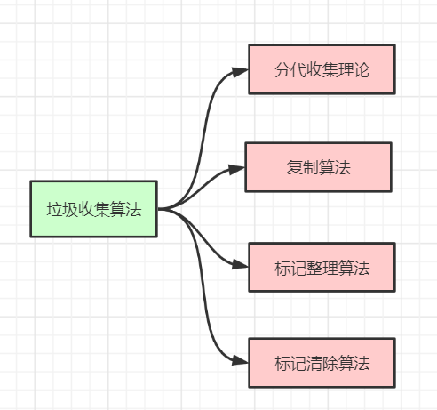
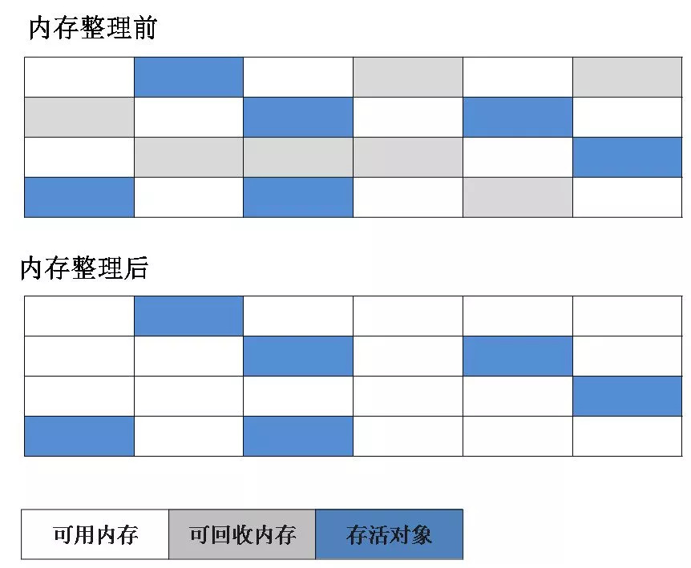
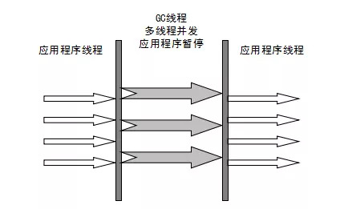
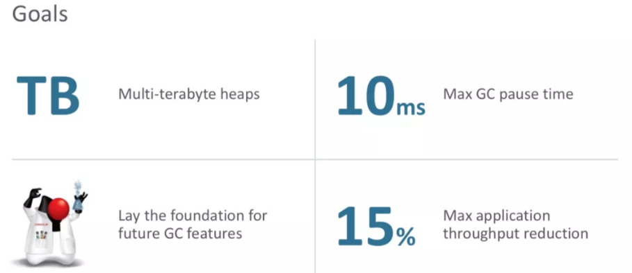
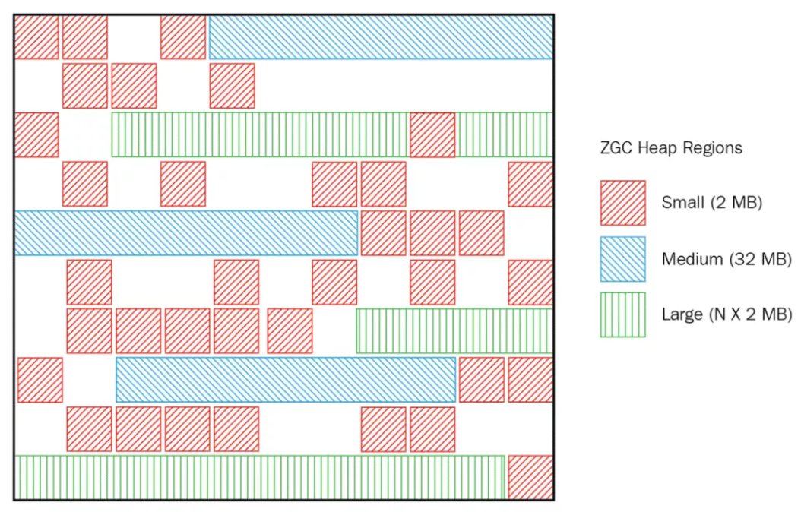
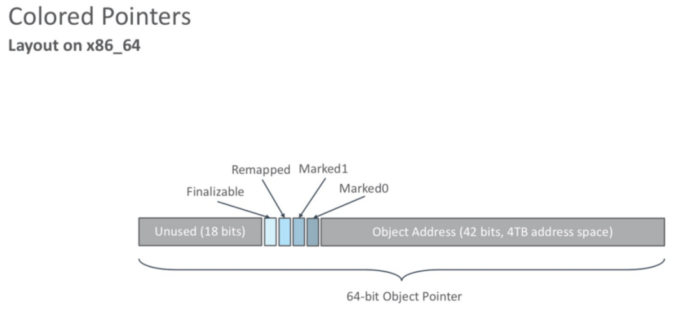
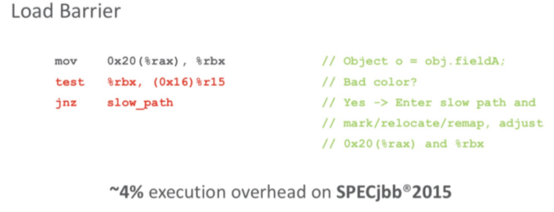
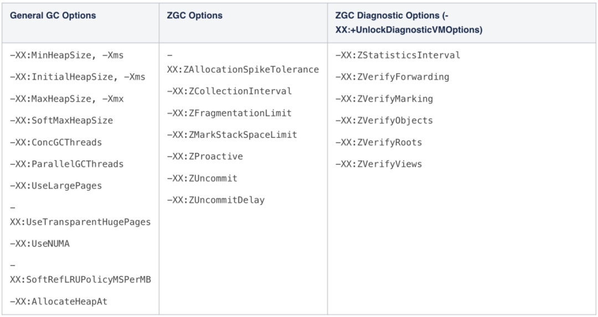
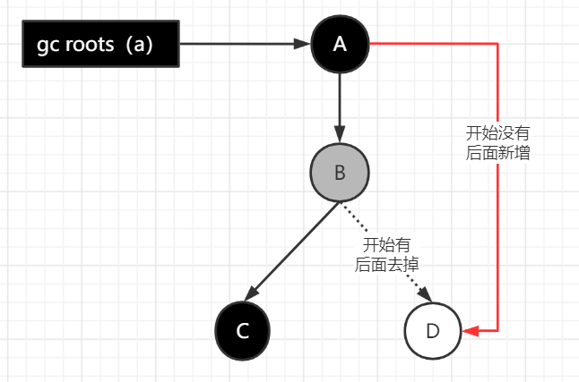
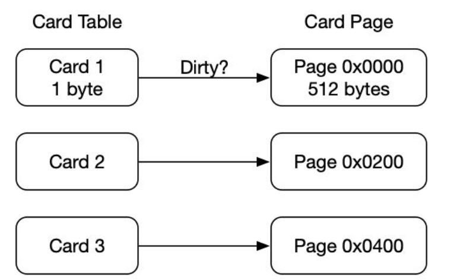

# JVM-2.垃圾收集算法与垃圾收集器

## 垃圾收集算法



### 分代收集理论

当前虚拟机的垃圾收集都采用分代收集算法，这种算法没有什么新的思想，只是根据对象存活周期的不同将内存分为几块。一般将java堆分为新生代和老年代，这样我们就可以根据各个年代的特点选择合适的垃圾收集算法。

比如在新生代中，每次收集都会有大量对象(近99%)死去，所以可以选择复制算法，只需要付出少量对象的复制成本就可以完成每次垃圾收集。而老年代的对象存活几率是比较高的，而且没有额外的空间对它进行分配担保，所以我们必须选择“标记-清除”或“标记-整理”算法进行垃圾收集。注意，“标记-清除”或“标记-整理”算法会比复制算法慢10倍以上。

### 标记-复制算法(年轻代)

为了解决效率问题，"复制"收集算法出现了。它可以将内存分为大小相同的两块，每次使用其中的一块。当这一块的内存使用完后，就将还存活的对象复制到另一块去，然后再把使用的空间一次清理掉。这样就使每次的内存回收都是对内存区间的一半进行回收。

**年轻代使用的算法**，因为绝大多数对象是存活周期非常短的对象，可能一次新生代GC后，99%的对象都被垃圾回收了，可能也就1%的对象存活下来。由于这个特性，所以就设计了留10%的新生代内存空间来存放一次GC后存活的对象。


### 标记-清除算法(老年代)

算法分为“标记”和“清除”阶段：标记存活的对象， 统一回收所有未被标记的对象(一般选择这种)；也可以反过来，标记出所有需要回收的对象，在标记完成后统一回收所有被标记的对象 。它是最基础的收集算法，比较简单，但是会带来两个明显的问题：

1. **效率问题  (如果需要标记的对象太多，效率不高)**
2. **空间问题（标记清除后会产生大量不连续的碎片）**



### 标记-整理算法(老年代)

根据老年代的特点特出的一种标记算法，标记过程仍然与“标记-清除”算法一样，但后续步骤不是直接对可回收对象回收，而是让所有存活的对象向一端移动，然后直接清理掉端边界以外的内存。


## 垃圾收集器


如果说收集算法是内存回收的方法论，那么垃圾收集器就是内存回收的具体实现。**前面的几种垃圾收集器组合都会产生**STW**问题，后面的G1、ZGC不会产生STW。**

虽然我们对各个收集器进行比较，但并非为了挑选出一个最好的收集器。因为直到现在为止还没有最好的垃圾收集器出现，更加没有万能的垃圾收集器，**我们能做的就是根据具体应用场景选择适合自己的垃圾收集器**。

### Serial收集器

**(-XX:+UseSerialGC  -XX:+UseSerialOldGC)**

Serial(串行)收集器是最基本、历史最悠久的垃圾收集器了。大家看名字就知道这个收集器是一个单线程收集器了。它的 **“单线程”** 的意义不仅仅意味着它只会使用一条垃圾收集线程去完成垃圾收集工作，更重要的是它在进行垃圾收集工作的时候必须暂停其他所有的工作线程（ **"Stop The World"** ），直到它收集结束。

**新生代采用复制算法，老年代采用标记-整理算法。**


虚拟机的设计者们当然知道Stop The World带来的不良用户体验，所以在后续的垃圾收集器设计中停顿时间在不断缩短（仍然还有停顿，寻找最优秀的垃圾收集器的过程仍然在继续）。

但是Serial收集器有没有优于其他垃圾收集器的地方呢？当然有，它**简单而高效（与其他收集器的单线程相比）**。Serial收集器由于没有线程交互的开销，自然可以获得很高的单线程收集效率。

**Serial Old收集器是Serial收集器的老年代版本**，它同样是一个单线程收集器。它主要有两大用途：一种用途是在JDK1.5以及以前的版本中与Parallel Scavenge收集器搭配使用，**另一种用途是作为CMS收集器的后备方案**。

### Parallel Scavenge收集器

**(-XX:+UseParallelGC(年轻代),-XX:+UseParallelOldGC(老年代))**

**Parallel**收集器其实**就是Serial收集器的多线程版本**，除了使用多线程进行垃圾收集外，其余行为（控制参数、收集算法、回收策略等等）和Serial收集器类似。默认的收集线程数跟cpu核数相同，当然也可以用参数(-XX:ParallelGCThreads)指定收集线程数，但是一般不推荐修改。

**Parallel Scavenge收集器关注点是吞吐量（高效率的利用CPU）。CMS等垃圾收集器的关注点更多的是用户线程的停顿时间（提高用户体验）。所谓吞吐量就是CPU中用于运行用户代码的时间与CPU总消耗时间的比值。** Parallel Scavenge收集器提供了很多参数供用户找到最合适的停顿时间或最大吞吐量，如果对于收集器运作不太了解的话，可以选择把内存管理优化交给虚拟机去完成也是一个不错的选择。

**新生代采用复制算法，老年代采用标记-整理算法。**



**Parallel Old收集器是Parallel Scavenge收集器的老年代版本**。使用多线程和“标记-整理”算法。在注重吞吐量以及CPU资源的场合，都可以优先考虑 Parallel Scavenge收集器和Parallel Old收集器(**JDK8默认的新生代和老年代收集器**)。

### ParNew收集器

**(-XX:+UseParNewGC)**

ParNew收集器其实**跟Parallel收集器很类似**，区别主要在于它可以和CMS收集器配合使用。paralel scavenge 可以设置最大gc停顿时间(-XX:MaxGCPauseMills)以及gc时间占比(-XX:GCTimeRatio)，可以设置吞吐量大小。

**新生代采用复制算法，老年代采用标记-整理算法。**


它是许多运行在Server模式下的虚拟机的首要选择，除了Serial收集器外，只有它能与CMS收集器（真正意义上的并发收集器，后面会介绍到）配合工作。

### CMS收集器

**(-XX:+UseConcMarkSweepGC(old))**

**CMS（Concurrent Mark Sweep）收集器是一种以获取最短回收停顿时间为目标的收集器。它非常符合在注重用户体验的应用上使用，它是HotSpot虚拟机第一款真正意义上的并发收集器，它第一次实现了让垃圾收集线程与用户线程（基本上）同时工作。**

从名字中的**Mark Sweep**这两个词可以看出，CMS收集器是一种 **“标记-清除”算法**实现的，它的运作过程相比于前面几种垃圾收集器来说更加复杂一些。整个过程分为四个步骤：

- **初始标记：** 暂停所有的其他线程(STW)，并记录下gc roots**直接能引用的对象**，**速度很快**。
- **并发标记：** 并发标记阶段就是从GC Roots的直接关联对象开始遍历整个对象图的过程， 这个过程耗时较长但是不需要停顿用户线程， 可以与垃圾收集线程一起并发运行。因为用户程序继续运行，可能会有导致已经标记过的对象状态发生改变。
- **重新标记：** 重新标记阶段就是为了修正并发标记期间因为用户程序继续运行而导致标记产生变动的那一部分对象的标记记录，**这个阶段的停顿时间一般会比初始标记阶段的时间稍长，远远比并发标记阶段时间短。主要用到三色标记里的****增量更新算法(见下面详解)做重新标记。**
- **并发清理：** 开启用户线程，同时GC线程开始对未标记的区域做清扫。这个阶段如果有新增对象会被标记为黑色不做任何处理(见下面三色标记算法详解)。
- **并发重置：**重置本次GC过程中的标记数据。


从它的名字就可以看出它是一款优秀的垃圾收集器，主要优点：**并发收集、低停顿**。但是它有下面几个明显的缺点：

- 对CPU资源敏感（会和服务抢资源）；
- 无法处理**浮动垃圾**(在并发标记和并发清理阶段又产生垃圾，这种浮动垃圾只能等到下一次gc再清理了)；
- 它使用的回收算法-**“标记-清除”算法**会导致收集结束时会有**大量空间碎片**产生，当然通过参数-XX:+UseCMSCompactAtFullCollection可以让jvm在执行完标记清除后再做整理
- 执行过程中的不确定性，会存在上一次垃圾回收还没执行完，然后垃圾回收又被触发的情况，**特别是在并发标记和并发清理阶段会出现**，一边回收，系统一边运行，也许没回收完就再次触发full gc，也就是"**concurrent mode failure**"，**此时会进入stop the world，用serial old垃圾收集器来回收**

#### CMS的相关核心参数

1. -XX:+UseConcMarkSweepGC：启用cms
2. -XX:ConcGCThreads：并发的GC线程数
3. -XX:+UseCMSCompactAtFullCollection：FullGC之后做压缩整理（减少碎片）
4. -XX:CMSFullGCsBeforeCompaction：多少次FullGC之后压缩一次，默认是0，代表每次FullGC后都会压缩一次
5. -XX:CMSInitiatingOccupancyFraction: 当老年代使用达到该比例时会触发FullGC（默认是92，这是百分比）
6. -XX:+UseCMSInitiatingOccupancyOnly：只使用设定的回收阈值(-XX:CMSInitiatingOccupancyFraction设定的值)，如果不指定，JVM仅在第一次使用设定值，后续则会自动调整
7. -XX:+CMSScavengeBeforeRemark：在CMS GC前启动一次minor gc，降低CMS GC标记阶段**(**也会对年轻代一起做标记，如果在minor gc就干掉了很多对垃圾对象，标记阶段就会减少一些标记时间**)**时的开销，一般CMS的GC耗时 80%都在标记阶段
8. -XX:+CMSParallellnitialMarkEnabled：表示在初始标记的时候多线程执行，缩短STW
9. -XX:+CMSParallelRemarkEnabled：在重新标记的时候多线程执行，缩短STW;


### G1收集器(-XX:+UseG1GC)

**G1 (Garbage-First)是一款面向服务器的垃圾收集器，<font color=red>主要针对配备多颗处理器及大容量内存的机器</font>。以极高概率满足GC停顿时间要求的同时,还具备高吞吐量性能特征.**


G1将Java堆划分为多个大小相等的独立区域(**Region**)，JVM目标是不超过2048个Region(JVM源码里TARGET_REGION_NUMBER 定义)，实际可以超过该值，但是不推荐。

一般Region大小等于堆大小除以2048，比如堆大小为4096M，则Region大小为2M，当然也可以用参数"-XX:G1HeapRegionSize"手动指定Region大小，但是推荐默认的计算方式。

G1保留了年轻代和老年代的概念，但不再是物理隔阂了，它们都是（可以不连续）Region的集合。

默认年轻代对堆内存的占比是5%，如果堆大小为4096M，那么年轻代占据200MB左右的内存，对应大概是100个Region，可以通过“-XX:G1NewSizePercent”设置新生代初始占比，在系统运行中，JVM会不停的给年轻代增加更多的Region，但是最多新生代的占比不会超过60%，可以通过“-XX:G1MaxNewSizePercent”调整。年轻代中的Eden和Survivor对应的region也跟之前一样，默认8:1:1，假设年轻代现在有1000个region，eden区对应800个，s0对应100个，s1对应100个。

一个Region可能之前是年轻代，如果Region进行了垃圾回收，之后可能又会变成老年代，也就是说Region的区域功能可能会动态变化。

G1垃圾收集器对于对象什么时候会转移到老年代跟之前讲过的原则一样，**唯一不同的是对大对象的处理**，G1有专门分配大对象的Region叫**Humongous区**，而不是让大对象直接进入老年代的Region中。在G1中，大对象的判定规则就是一个大对象超过了一个Region大小的50%，比如按照上面算的，每个Region是2M，只要一个大对象超过了1M，就会被放入Humongous中，而且一个大对象如果太大，可能会横跨多个Region来存放。

Humongous区专门存放短期巨型对象，不用直接进老年代，可以节约老年代的空间，避免因为老年代空间不够的GC开销。

Full GC的时候除了收集年轻代和老年代之外，也会将Humongous区一并回收。

G1收集器一次GC(主要值Mixed GC)的运作过程大致分为以下几个步骤：

- **初始标记**（initial mark，STW）：暂停所有的其他线程，并记录下gc roots直接能引用的对象，**速度很快** ；

- **并发标记**（Concurrent Marking）：同CMS的并发标记
- **最终标记**（Remark，STW）：同CMS的重新标记
- **筛选回收**（Cleanup，STW）：筛选回收阶段首先对各个Region的**回收价值和成本进行排序**，**根据用户所期望的GC停顿STW时间(可以用JVM参数 -XX:MaxGCPauseMillis指定)来制定回收计划**，比如说老年代此时有1000个Region都满了，但是因为根据预期停顿时间，本次垃圾回收可能只能停顿200毫秒，那么通过之前回收成本计算得知，可能回收其中800个Region刚好需要200ms，那么就只会回收800个Region(**Collection Set**，要回收的集合)，尽量把GC导致的停顿时间控制在我们指定的范围内。这个阶段其实也可以做到与用户程序一起并发执行，但是因为只回收一部分Region，时间是用户可控制的，而且停顿用户线程将大幅提高收集效率。不管是年轻代或是老年代，**回收算法主要用的是复制算法**，**将一个region中的存活对象复制到另一个region中，这种不会像CMS那样回收完因为有很多内存碎片还需要整理一次，G1采用复制算法回收几乎不会有太多内存碎片**。(注意：CMS回收阶段是跟用户线程一起并发执行的，G1因为内部实现太复杂暂时没实现并发回收，不过到了ZGC，Shenandoah就实现了并发收集，Shenandoah可以看成是G1的升级版本)


**G1收集器在后台维护了一个优先列表，每次根据允许的收集时间，优先选择回收价值最大的Region(这也就是它的名字Garbage-First的由来)，比如一个Region花200ms能回收10M垃圾，另外一个Region花50ms能回收20M垃圾，在回收时间有限情况下，G1当然会优先选择后面这个Region回收**。这种使用Region划分内存空间以及有优先级的区域回收方式，保证了G1收集器在有限时间内可以尽可能高的收集效率。

被视为JDK1.7以上版本Java虚拟机的一个重要进化特征。它具备以下特点：

- **并行与并发**：G1能充分利用CPU、多核环境下的硬件优势，使用多个CPU（CPU或者CPU核心）来缩短Stop-The-World停顿时间。部分其他收集器原本需要停顿Java线程来执行GC动作，G1收集器仍然可以通过并发的方式让java程序继续执行。
- **分代收集**：虽然G1可以不需要其他收集器配合就能独立管理整个GC堆，但是还是保留了分代的概念。
- **空间整合**：与CMS的“标记--清理”算法不同，G1从整体来看是基于“**标记整理**”算法实现的收集器；从局部上来看是基于“复制”算法实现的。
- **可预测的停顿**：这是G1相对于CMS的另一个大优势，降低停顿时间是G1 和 CMS 共同的关注点，但G1 除了追求低停顿外，还能建立**可预测的停顿时间模型**，能让使用者明确指定在一个长度为M毫秒的时间片段(通过参数"**-XX:MaxGCPauseMillis**"指定)内完成垃圾收集。

毫无疑问， 可以由用户指定期望的停顿时间是G1收集器很强大的一个功能， 设置不同的期望停顿时间， 可使得G1在不同应用场景中取得关注吞吐量和关注延迟之间的最佳平衡。 不过， 这里设置的“期望值”必须是符合实际的， 不能异想天开， 毕竟G1是要冻结用户线程来复制对象的， 这个停顿时

间再怎么低也得有个限度。 它默认的停顿目标为两百毫秒， 一般来说， 回收阶段占到几十到一百甚至接近两百毫秒都很正常， 但如果我们把停顿时间调得非常低， 譬如设置为二十毫秒， 很可能出现的结果就是由于停顿目标时间太短， 导致每次选出来的回收集只占堆内存很小的一部分， 收集器收集的速度逐渐跟不上分配器分配的速度， 导致垃圾慢慢堆积。 很可能一开始收集器还能从空闲的堆内存中获得一些喘息的时间， 但应用运行时间一长就不行了， 最终占满堆引发Full GC反而降低性能， 所以通常把期望停顿时间设置为一两百毫秒或者两三百毫秒会是比较合理的。

#### G1垃圾收集分类

##### YoungGC

YoungGC并不是说现有的Eden区放满了就会马上触发，G1会计算下现在Eden区回收大概要多久时间，如果回收时间远远小于参数 -XX:MaxGCPauseMills 设定的值，那么增加年轻代的region，继续给新对象存放，不会马上做Young GC，直到下一次Eden区放满，G1计算回收时间接近参数 -XX:MaxGCPauseMills 设定的值，那么就会触发Young GC

##### MixedGC

不是FullGC，老年代的堆占有率达到参数(**-XX:InitiatingHeapOccupancyPercent**)设定的值则触发，回收所有的Young和部分Old(根据期望的GC停顿时间确定old区垃圾收集的优先顺序)以及**大对象区**，正常情况G1的垃圾收集是先做MixedGC，主要使用复制算法，需要把各个region中存活的对象拷贝到别的region里去，拷贝过程中如果发现**没有足够的空region**能够承载拷贝对象就会触发一次Full GC

##### Full GC

停止系统程序，然后采用单线程进行标记、清理和压缩整理，好空闲出来一批Region来供下一次MixedGC使用，这个过程是非常耗时的。(Shenandoah优化成多线程收集了)

**G1收集器参数设置**

  -XX:+UseG1GC:使用G1收集器

  -XX:ParallelGCThreads:指定GC工作的线程数量

  -XX:G1HeapRegionSize:指定分区大小(1MB~32MB，且必须是2的N次幂)，默认将整堆划分为2048个分区

  -XX:MaxGCPauseMillis:目标暂停时间(默认200ms)

  -XX:G1NewSizePercent:新生代内存初始空间(默认整堆5%，值配置整数，默认就是百分比)

  -XX:G1MaxNewSizePercent:新生代内存最大空间

  -XX:TargetSurvivorRatio:Survivor区的填充容量(默认50%)，Survivor区域里的一批对象(年龄1+年龄2+年龄n的多个年龄对象)总和超过了Survivor区域的50%，此时就会把年龄n(含)以上的对象都放入老年代

  -XX:MaxTenuringThreshold:最大年龄阈值(默认15)

  -XX:InitiatingHeapOccupancyPercent:老年代占用空间达到整堆内存阈值(默认45%)，则执行新生代和老年代的混合收集(**MixedGC**)，比如我们之前说的堆默认有2048个region，如果有接近1000个region都是老年代的region，则可能就要触发MixedGC了

 -XX:G1MixedGCLiveThresholdPercent(默认85%)  region中的存活对象低于这个值时才会回收该region，如果超过这个值，存活对象过多，回收的的意义不大。

  -XX:G1MixedGCCountTarget:在一次回收过程中指定做几次筛选回收(默认8次)，在最后一个筛选回收阶段可以回收一会，然后暂停回收，恢复系统运行，一会再开始回收，这样可以让系统不至于单次停顿时间过长。

  -XX:G1HeapWastePercent(默认5%): gc过程中空出来的region是否充足阈值，在混合回收的时候，对Region回收都是基于复制算法进行的，都是把要回收的Region里的存活对象放入其他Region，然后这个Region中的垃圾对象全部清理掉，这样的话在回收过程就会不断空出来新的Region，一旦空闲出来的Region数量达到了堆内存的5%，此时就会立即停止混合回收，意味着本次混合回收就结束了。

##### G1垃圾收集器优化建议

假设参数 -XX:MaxGCPauseMills 设置的值很大，导致系统运行很久，年轻代可能都占用了堆内存的60%了，此时才触发年轻代gc。

那么存活下来的对象可能就会很多，此时就会导致Survivor区域放不下那么多的对象，就会进入老年代中。

或者是你年轻代gc过后，存活下来的对象过多，导致进入Survivor区域后触发了动态年龄判定规则，达到了Survivor区域的50%，也会快速导致一些对象进入老年代中。

所以这里核心还是在于调节 -XX:MaxGCPauseMills 这个参数的值，在保证他的年轻代gc别太频繁的同时，还得考虑每次gc过后的存活对象有多少,避免存活对象太多快速进入老年代，频繁触发mixed gc.

#### C1收集器适合场景

1. 50%以上的堆被存活对象占用
2. 对象分配和晋升的速度变化非常大
3. 垃圾回收时间特别长，超过1秒
4. 8GB以上的堆内存(建议值)
5. 停顿时间是500ms以内

**每秒几十万并发的系统如何优化JVM**

Kafka类似的支撑高并发消息系统大家肯定不陌生，对于kafka来说，每秒处理几万甚至几十万消息时很正常的，一般来说部署kafka需要用大内存机器(比如64G)，也就是说可以给年轻代分配个三四十G的内存用来支撑高并发处理，这里就涉及到一个问题了，我们以前常说的对于eden区的young gc是很快的，这种情况下它的执行还会很快吗？很显然，不可能，因为内存太大，处理还是要花不少时间的，假设三四十G内存回收可能最快也要几秒钟，按kafka这个并发量放满三四十G的eden区可能也就一两分钟吧，那么意味着整个系统每运行一两分钟就会因为young gc卡顿几秒钟没法处理新消息，显然是不行的。那么对于这种情况如何优化了，我们可以使用G1收集器，设置 -XX:MaxGCPauseMills 为50ms，假设50ms能够回收三到四个G内存，然后50ms的卡顿其实完全能够接受，用户几乎无感知，那么整个系统就可以在卡顿几乎无感知的情况下一边处理业务一边收集垃圾。

G1天生就适合这种大内存机器的JVM运行，可以比较完美的解决大内存垃圾回收时间过长的问题。

**ZGC收集器(-XX:+UseZGC)**

参考文章：https://wiki.openjdk.java.net/display/zgc/Main

http://cr.openjdk.java.net/~pliden/slides/ZGC-Jfokus-2018.pdf

ZGC是一款JDK 11中新加入的具有实验性质的低延迟垃圾收集器，ZGC可以说源自于是Azul System公司开发的C4（Concurrent Continuously Compacting Collector） 收集器。

##### ZGC目标

如下图所示，ZGC的目标主要有4个：




- **支持TB量级的堆**。我们生产环境的硬盘还没有上TB呢，这应该可以满足未来十年内，所有JAVA应用的需求了吧。
- **最大GC停顿时间不超10ms**。目前一般线上环境运行良好的JAVA应用Minor GC停顿时间在10ms左右，Major GC一般都需要100ms以上（G1可以调节停顿时间，但是如果调的过低的话，反而会适得其反），之所以能做到这一点是因为它的停顿时间主要跟Root扫描有关，而Root数量和堆大小是没有任何关系的。
- **奠定未来GC特性的基础**。
- **最糟糕的情况下吞吐量会降低15%**。这都不是事，停顿时间足够优秀。至于吞吐量，通过扩容分分钟解决。

另外，Oracle官方提到了它最大的优点是：它的停顿时间不会随着堆的增大而增长！也就是说，几十G堆的停顿时间是10ms以下，几百G甚至上T堆的停顿时间也是10ms以下。

##### 不分代(暂时)

单代，即ZGC「没有分代」。我们知道以前的垃圾回收器之所以分代，是因为源于“「大部分对象朝生夕死」”的假设，事实上大部分系统的对象分配行为也确实符合这个假设。

那么为什么ZGC就不分代呢？因为分代实现起来麻烦，作者就先实现出一个比较简单可用的单代版本，后续会优化。

##### ZGC内存布局

ZGC收集器是一款基于Region内存布局的， 暂时不设分代的， 使用了**读屏障、 颜色指针**等技术来实现可并发的标记-整理算法的， 以低延迟为首要目标的一款垃圾收集器。

ZGC的Region可以具有如图3-19所示的大、 中、 小三类容量：

- 小型Region（Small Region） ： 容量固定为2MB， 用于放置小于256KB的小对象。
- 中型Region（Medium Region） ： 容量固定为32MB， 用于放置大于等于256KB但小于4MB的对象。
- 大型Region（Large Region） ： 容量不固定， 可以动态变化， 但必须为2MB的整数倍， 用于放置4MB或以上的大对象。 **每个大型Region中只会存放一个大对象**， 这也预示着虽然名字叫作“大型Region”， 但它的实际容量完全有可能小于中型Region， 最小容量可低至4MB。 大型Region在ZGC的实现中是不会被重分配（重分配是ZGC的一种处理动作， 用于复制对象的收集器阶段， 稍后会介绍到）的， 因为复制一个大对象的代价非常高昂。



##### NUMA-aware

NUMA对应的有UMA，UMA即**Uniform Memory Access Architecture**，NUMA就是Non Uniform Memory Access Architecture。UMA表示内存只有一块，所有CPU都去访问这一块内存，那么就会存在竞争问题（争夺内存总线访问权），有竞争就会有锁，有锁效率就会受到影响，而且CPU核心数越多，竞争就越激烈。NUMA的话每个CPU对应有一块内存，且这块内存在主板上离这个CPU是最近的，每个CPU优先访问这块内存，那效率自然就提高了：


服务器的NUMA架构在中大型系统上一直非常盛行，也是高性能的解决方案，尤其在系统延迟方面表现都很优秀。ZGC是能自动感知NUMA架构并充分利用NUMA架构特性的。

##### ZGC运作过程

ZGC的运作过程大致可划分为以下四个大的阶段：


- **并发标记（Concurrent Mark）**：与G1一样，并发标记是遍历对象图做可达性分析的阶段，它的初始标记(**Mark Start**)和最终标记(**Mark End**)也会出现短暂的停顿，与G1不同的是， ZGC的标记是在指针上而不是在对象上进行的， 标记阶段会更新**颜色指针**(见下面详解)中的Marked 0、 Marked 1标志位。
- **并发预备重分配（Concurrent Prepare for Relocate）**：这个阶段需要根据特定的查询条件统计得出本次收集过程要清理哪些Region，将这些Region组成重分配集（Relocation Set）。ZGC每次回收都会扫描所有的Region，用范围更大的扫描成本换取省去G1中记忆集的维护成本。
- **并发重分配（Concurrent Relocate）**：重分配是ZGC执行过程中的核心阶段，这个过程要把重分配集中的存活对象复制到新的Region上，并为重分配集中的每个Region维护一个**转发表（Forward Table）**，记录从旧对象到新对象的转向关系。ZGC收集器能仅从引用上就明确得知一个对象是否处于重分配集之中，如果用户线程此时并发访问了位于重分配集中的对象，这次访问将会被预置的内存屏障(**读屏障**(见下面详解))所截获，然后立即根据Region上的转发表记录将访问转发到新复制的对象上，并同时修正更新该引用的值，使其直接指向新对象，ZGC将这种行为称为指针的“自愈”（Self-Healing）能力。

```shell
ZGC的颜色指针因为“自愈”（Self-Healing）能力，所以只有第一次访问旧对象会变慢， 一旦重分配集中某个Region的存活对象都复制完毕后，这个Region就可以立即释放用于新对象的分配，但是转发表还得留着不能释放掉， 因为可能还有访问在使用这个转发表。
```

- **并发重映射（Concurrent Remap）**：重映射所做的就是修正整个堆中指向重分配集中旧对象的所有引用，但是ZGC中对象引用存在“自愈”功能，所以这个重映射操作并不是很迫切。ZGC很巧妙地把并发重映射阶段要做的工作，合并到了下一次垃圾收集循环中的并发标记阶段里去完成，反正它们都是要遍历所有对象的，这样合并就节省了一次遍历对象图的开销。一旦所有指针都被修正之后， 原来记录新旧对象关系的转发表就可以释放掉了。

##### 颜色指针

Colored Pointers，即颜色指针，如下图所示，ZGC的核心设计之一。以前的垃圾回收器的GC信息都保存在对象头中，而ZGC的GC信息保存在指针中。



每个对象有一个64位指针，这64位被分为：

- 18位：预留给以后使用；
- 1位：Finalizable标识，此位与并发引用处理有关，它表示这个对象只能通过finalizer才能访问；
- 1位：Remapped标识，设置此位的值后，对象未指向relocation set中（relocation set表示需要GC的Region集合）；
- 1位：Marked1标识；
- 1位：Marked0标识，和上面的Marked1都是标记对象用于辅助GC；
- 42位：对象的地址（所以它可以支持2^42=4T内存）：

**为什么有2个mark标记？**

每一个GC周期开始时，会交换使用的标记位，使上次GC周期中修正的已标记状态失效，所有引用都变成未标记。

GC周期1：使用mark0, 则周期结束所有引用mark标记都会成为01。

GC周期2：使用mark1, 则期待的mark标记10，所有引用都能被重新标记。

通过对配置ZGC后对象指针分析我们可知，对象指针必须是64位，那么ZGC就无法支持32位操作系统，同样的也就无法支持压缩指针了（CompressedOops，压缩指针也是32位）。

**颜色指针的三大优势：**

1. 一旦某个Region的存活对象被移走之后，这个Region立即就能够被释放和重用掉，而不必等待整个堆中所有指向该Region的引用都被修正后才能清理，这使得理论上只要还有一个空闲Region，ZGC就能完成收集。
2. 颜色指针可以大幅减少在垃圾收集过程中内存屏障的使用数量，ZGC只使用了读屏障。
3. 颜色指针具备强大的扩展性，它可以作为一种可扩展的存储结构用来记录更多与对象标记、重定位过程相关的数据，以便日后进一步提高性能。

**读屏障**

之前的GC都是采用Write Barrier，这次ZGC采用了完全不同的方案读屏障，这个是ZGC一个非常重要的特性。

在标记和移动对象的阶段，每次「从堆里对象的引用类型中读取一个指针」的时候，都需要加上一个Load Barriers。

那么我们该如何理解它呢？看下面的代码，第一行代码我们尝试读取堆中的一个对象引用obj.fieldA并赋给引用o（fieldA也是一个对象时才会加上读屏障）。如果这时候对象在GC时被移动了，接下来JVM就会加上一个读屏障，这个屏障会把读出的指针更新到对象的新地址上，并且把堆里的这个指针“修正”到原本的字段里。这样就算GC把对象移动了，读屏障也会发现并修正指针，于是应用代码就永远都会持有更新后的有效指针，而且不需要STW。

那么，JVM是如何判断对象被移动过呢？就是利用上面提到的颜色指针，如果指针是Bad Color，那么程序还不能往下执行，需要「slow path」，修正指针；如果指针是Good Color，那么正常往下执行即可：


❝ 这个动作是不是非常像JDK并发中用到的CAS自旋？读取的值发现已经失效了，需要重新读取。而ZGC这里是之前持有的指针由于GC后失效了，需要通过读屏障修正指针。❞

后面3行代码都不需要加读屏障：Object p = o这行代码并没有从堆中读取数据；o.doSomething()也没有从堆中读取数据；obj.fieldB不是对象引用，而是原子类型。

正是因为Load Barriers的存在，所以会导致配置ZGC的应用的吞吐量会变低。官方的测试数据是需要多出额外4%的开销：



那么，判断对象是Bad Color还是Good Color的依据是什么呢？就是根据上一段提到的Colored Pointers的4个颜色位。当加上读屏障时，根据对象指针中这4位的信息，就能知道当前对象是Bad/Good Color了。

**PS：**既然低42位指针可以支持4T内存，那么能否通过预约更多位给对象地址来达到支持更大内存的目的呢？答案肯定是不可以。因为目前主板地址总线最宽只有48bit，4位是颜色位，就只剩44位了，所以受限于目前的硬件，ZGC最大只能支持16T的内存，JDK13就把最大支持堆内存从4T扩大到了16T。

##### ZGC存在的问题

ZGC最大的问题是**浮动垃圾**。ZGC的停顿时间是在10ms以下，但是ZGC的执行时间还是远远大于这个时间的。假如ZGC全过程需要执行10分钟，在这个期间由于对象分配速率很高，将创建大量的新对象，这些对象很难进入当次GC，所以只能在下次GC的时候进行回收，这些只能等到下次GC才能回收的对象就是浮动垃圾。

> ZGC没有分代概念，每次都需要进行全堆扫描，导致一些“朝生夕死”的对象没能及时的被回收。

**解决方案**

目前唯一的办法是增大堆的容量，使得程序得到更多的喘息时间，但是这个也是一个治标不治本的方案。如果需要从根本上解决这个问题，还是需要引入分代收集，让新生对象都在一个专门的区域中创建，然后专门针对这个区域进行更频繁、更快的收集。

##### ZGC参数设置

启用ZGC比较简单，设置JVM参数即可：-XX:+UnlockExperimentalVMOptions 「-XX:+UseZGC」。调优也并不难，因为ZGC调优参数并不多，远不像CMS那么复杂。它和G1一样，可以调优的参数都比较少，大部分工作JVM能很好的自动完成。下图所示是ZGC可以调优的参数：



**ZGC触发时机**

ZGC目前有4中机制触发GC：

- 定时触发，默认为不使用，可通过ZCollectionInterval参数配置。
- 预热触发，最多三次，在堆内存达到10%、20%、30%时触发，主要时统计GC时间，为其他GC机制使用。
- 分配速率，基于正态分布统计，计算内存99.9%可能的最大分配速率，以及此速率下内存将要耗尽的时间点，在耗尽之前触发GC（耗尽时间 - 一次GC最大持续时间 - 一次GC检测周期时间）。
- 主动触发，（默认开启，可通过ZProactive参数配置） 距上次GC堆内存增长10%，或超过5分钟时，对比距上次GC的间隔时间跟（49 * 一次GC的最大持续时间），超过则触发。

### 如何选择垃圾收集器

1. 优先调整堆的大小让服务器自己来选择
2. 如果内存小于100M，使用串行收集器
3. 如果是单核，并且没有停顿时间的要求，串行或JVM自己选择
4. 如果允许停顿时间超过1秒，选择并行或者JVM自己选
5. 如果响应时间最重要，并且不能超过1秒，使用并发收集器
6. **4G以下可以用parallel，4-8G可以用ParNew+CMS，8G以上可以用G1，几百G以上用ZGC**

**下图有连线的可以搭配使用**


**JDK 1.8默认使用 Parallel(年轻代和老年代都是)**

**JDK 1.9默认使用 G1**

**安全点与安全区域**

**安全点**就是指代码中一些特定的位置,当线程运行到这些位置时它的状态是确定的,这样JVM就可以安全的进行一些操作,比如GC等，所以GC不是想什么时候做就立即触发的，是需要等待所有线程运行到安全点后才能触发。

这些特定的安全点位置主要有以下几种:

1. 方法返回之前
2. 调用某个方法之后
3. 抛出异常的位置
4. 循环的末尾

大体实现思想是当垃圾收集需要中断线程的时候， 不直接对线程操作， 仅仅简单地设置一个标志位， 各个线程执行过程时会不停地主动去轮询这个标志， 一旦发现中断标志为真时就自己在最近的安全点上主动中断挂起。 轮询标志的地方和安全点是重合的。

**安全区域又是什么？**

Safe Point 是对正在执行的线程设定的。

如果一个线程处于 Sleep 或中断状态，它就不能响应 JVM 的中断请求，再运行到 Safe Point 上。

因此 JVM 引入了 Safe Region。

Safe Region 是指在一段代码片段中，**引用关系不会发生变化**。在这个区域内的任意地方开始 GC 都是安全的。


### JAVA 1.8默认垃圾收集器

对于JDK8默认的垃圾回收器是-XX:+UseParallelGC(年轻代)和-XX:+UseParallelOldGC(老年代)，如果内存较大(超过4个G，只是经验值)，系统对停顿时间比较敏感，我们可以使用**ParNew+CMS(**-XX:+UseParNewGC -XX:+UseConcMarkSweepGC**)**

对于老年代CMS的参数如何设置我们可以思考下，首先我们想下当前这个系统有哪些对象可能会长期存活躲过5次以上minor gc最终进入老年代。

无非就是那些Spring容器里的Bean，线程池对象，一些初始化缓存数据对象等，这些加起来充其量也就几十MB。

还有就是某次minor gc完了之后还有超过一两百M的对象存活，那么就会直接进入老年代，比如突然某一秒瞬间要处理五六百单，那么每秒生成的对象可能有一百多M，再加上整个系统可能压力剧增，一个订单要好几秒才能处理完，下一秒可能又有很多订单过来。

我们可以估算下大概每隔五六分钟出现一次这样的情况，那么大概半小时到一小时之间就可能因为老年代满了触发一次Full GC，Full GC的触发条件还有我们之前说过的**老年代空间分配担保机制**，历次的minor gc挪动到老年代的对象大小肯定是非常小的，所以几乎不会在minor gc触发之前由于老年代空间分配担保失败而产生full gc，其实在半小时后发生full gc，这时候已经过了抢购的最高峰期，后续可能几小时才做一次FullGC。

对于碎片整理，因为都是1小时或几小时才做一次FullGC，是可以每做完一次就开始碎片整理，或者两到三次之后再做一次也行。

综上，只要年轻代参数设置合理，老年代CMS的参数设置基本都可以用默认值，如下所示：


## 垃圾收集底层算法实现

### 三色标记

**在并发标记的过程中，因为标记期间应用线程还在继续跑，对象间的引用可能发生变化，多标和漏标的情况就有可能发生。**

**这里引入"三色标记"来给大家解释下，把Gcroots可达性分析遍历对象过程中遇到的对象， 按照"是否访问过"这个条件标记成以下三种颜色：**

- **黑色**： 表示对象已经被垃圾收集器访问过， 且这个对象的所有引用都已经扫描过。 黑色的对象代表已经扫描过， 它是安全存活的， 如果有其他对象引用指向了黑色对象， 无须重新扫描一遍。 黑色对象不可能直接（不经过灰色对象） 指向某个白色对象。

- **灰色**： 表示对象已经被垃圾收集器访问过， 但这个对象上至少存在一个引用还没有被扫描过。

- **白色**： 表示对象尚未被垃圾收集器访问过。 显然在可达性分析刚刚开始的阶段， 所有的对象都是白色的， 若在分析结束的阶段， 仍然是白色的对象， 即代表不可达。



#### 多标-浮动垃圾

在并发标记过程中，如果由于方法运行结束导致部分局部变量(gcroot)被销毁，这个gcroot引用的对象之前又被扫描过(被标记为非垃圾对象)，那么本轮GC不会回收这部分内存。这部分本应该回收但是没有回收到的内存，被称之为"**浮动垃圾**"。浮动垃圾并不会影响垃圾回收的正确性，只是需要等到下一轮垃圾回收中才被清除。

另外，**针对并发标记(还有并发清理)开始后产生的新对象，通常的做法是直接全部当成黑色**，本轮不会进行清除。这部分对象期间可能也会变为垃圾，这也算是浮动垃圾的一部分。

**漏标-读写屏障**

漏标会导致被引用的对象被当成垃圾误删除，这是严重bug，必须解决，有两种解决方案： **增量更新（Incremental Update） 和原始快照（Snapshot At The Beginning，SATB） 。**

**增量更新**就是当黑色对象插入新的指向白色对象的引用关系时， 就将这个新插入的引用记录下来， 等并发扫描结束之后， 再将这些记录过的引用关系中的黑色对象为根， 重新扫描一次。 这可以简化理解为， **黑色对象一旦新插入了指向白色对象的引用之后， 它就变回灰色对象了**。

**原始快照**就是当灰色对象要删除指向白色对象的引用关系时， 就将这个要删除的引用记录下来， 在并发扫描结束之后， 再将这些记录过的引用关系中的灰色对象为根， 重新扫描一次，这样就能扫描到白色的对象，将白色对象直接标记为黑色(**目的就是让这种对象在本轮gc清理中能存活下来，待下一轮gc的时候重新扫描，这个对象也有可能是浮动垃圾**)

以上无论是对引用关系记录的插入还是删除， 虚拟机的记录操作都是通过**写屏障**实现的。

#### 写屏障

给某个对象的成员变量赋值时，其底层代码大概长这样：

```java
/**
* @param field 某对象的成员变量，如 a.b.d 
* @param new_value 新值，如 null
*/
void oop_field_store(oop* field, oop new_value) { 
    *field = new_value; // 赋值操作
} 
```

所谓的写屏障，其实就是指在赋值操作前后，加入一些处理（可以参考AOP的概念）：

- **写屏障实现SATB**

当对象B的成员变量的引用发生变化时，比如引用消失（a.b.d = null），我们可以利用写屏障，将B**原来成员变量的引用**对象D记录下来：

```java
void pre_write_barrier(oop* field) {
    oop old_value = *field;    // 获取旧值
    remark_set.add(old_value); // 记录原来的引用对象
}
```

- **写屏障实现增量更新**

当对象A的成员变量的引用发生变化时，比如新增引用（a.d = d），我们可以利用写屏障，将A**新的成员变量引用**对象D记录下来：

```java
void post_write_barrier(oop* field, oop new_value) {  
    remark_set.add(new_value);  // 记录新引用的对象
}
```

#### 读屏障

```java
oop oop_field_load(oop* field) {
    pre_load_barrier(field); // 读屏障-读取前操作
    return *field;
}
```

现代追踪式（可达性分析）的垃圾回收器几乎都借鉴了三色标记的算法思想，尽管实现的方式不尽相同：比如白色/黑色集合一般都不会出现（但是有其他体现颜色的地方）、灰色集合可以通过栈/队列/缓存日志等方式进行实现、遍历方式可以是广度/深度遍历等等。

对于读写屏障，以Java HotSpot VM为例，其并发标记时对漏标的处理方案如下：

- **CMS：写屏障 + 增量更新**
- **G1，Shenandoah：写屏障 + SATB**
- **ZGC：读屏障**

工程实现中，读写屏障还有其他功能，比如写屏障可以用于记录跨代/区引用的变化，读屏障可以用于支持移动对象的并发执行等。功能之外，还有性能的考虑，所以对于选择哪种，每款垃圾回收器都有自己的想法。

**为什么G1用SATB？CMS用增量更新？**

**我的理解**：SATB相对增量更新效率会高(当然SATB可能造成更多的浮动垃圾)，因为不需要在重新标记阶段再次深度扫描被删除引用对象，而CMS对增量引用的根对象会做深度扫描，G1因为很多对象都位于不同的region，CMS就一块老年代区域，重新深度扫描对象的话G1的代价会比CMS高，所以G1选择SATB不深度扫描对象，只是简单标记，等到下一轮GC再深度扫描。

**记忆集与卡表**

在新生代做GCRoots可达性扫描过程中可能会碰到跨代引用的对象，这种如果又去对老年代再去扫描效率太低了。

为此，在新生代可以引入记录集（**Remember Set**）的数据结构（记录从非收集区到收集区的指针集合），避免把整个老年代加入GCRoots扫描范围。事实上并不只是新生代、 老年代之间才有跨代引用的问题， 所有涉及部分区域收集（Partial GC） 行为的垃圾收集器， 典型的如G1、 ZGC和Shenandoah收集器， 都会面临相同的问题。

垃圾收集场景中，收集器只需通过记忆集判断出某一块非收集区域是否存在指向收集区域的指针即可，无需了解跨代引用指针的全部细节。

hotspot使用一种叫做“卡表”(**Cardtable**)的方式实现记忆集，也是目前最常用的一种方式。关于卡表与记忆集的关系， 可以类比为Java语言中HashMap与Map的关系。

卡表是使用一个字节数组实现：CARD_TABLE[ ]，每个元素对应着其标识的内存区域一块特定大小的内存块，称为“卡页”。

hotSpot使用的卡页是2^9大小，即512字节



一个卡页中可包含多个对象，只要有一个对象的字段存在跨代指针，其对应的卡表的元素标识就变成1，表示该元素变脏，否则为0.

GC时，只要筛选本收集区的卡表中变脏的元素加入GCRoots里。

**卡表的维护**

卡表变脏上面已经说了，但是需要知道如何让卡表变脏，即发生引用字段赋值时，如何更新卡表对应的标识为1。

Hotspot使用**写屏障**维护卡表状态。

