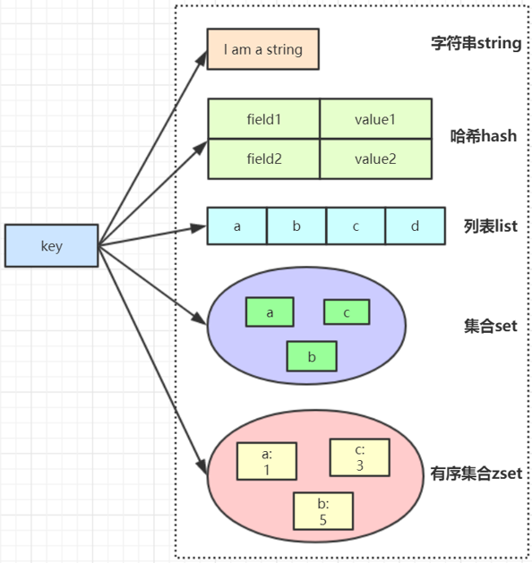
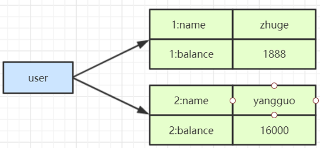
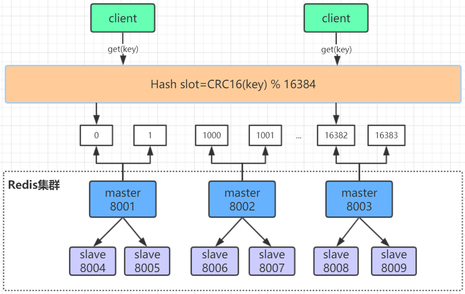
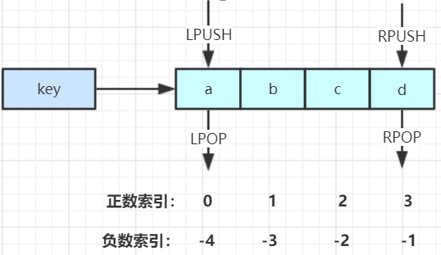
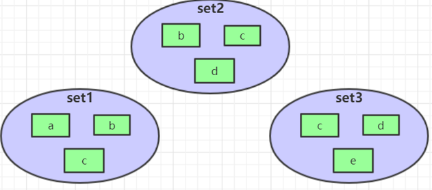
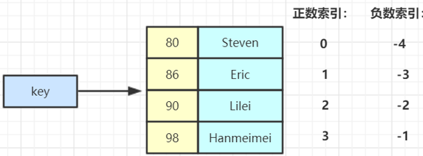
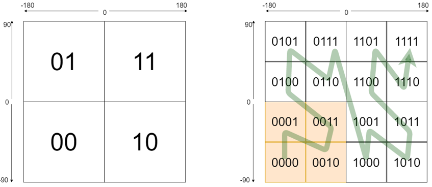

# redis数据类型

## redis的五大数据类型



## String结构

### 字符串常用操作

```shell
SET  key  value 			//存入字符串键值对 
MSET  key  value [key value ...] 	//批量存储字符串键值对 
SETNX  key  value 		//存入一个不存在的字符串键值对 
GET  key 			//获取一个字符串键值 
MGET  key  [key ...]	 	//批量获取字符串键值 
DEL  key  [key ...] 		//删除一个键 
EXPIRE  key  seconds 		//设置一个键的过期时间(秒) 原子加减 
```

### 原子加减

```shell
INCR  key 			//将key中储存的数字值加1 
DECR  key 			//将key中储存的数字值减1 
INCRBY  key  increment 		//将key所储存的值加上
increment DECRBY  key  decrement 	//将key所储存的值减去decrement
```

### 单值缓存

```shell
SET  key  value
GET  key 	
```

### 对象缓存

```shell
1) SET  user:1  value(json格式数据) 
2) MSET  user:1:name  zhuge   user:1:balance  1888    // 批量操作
   MGET  user:1:name   user:1:balance
```

### 分布式锁

```shell
SETNX  product:10001  true 		//返回1代表获取锁成功 
SETNX  product:10001  true 		//返回0代表获取锁失败...执行业务操作 
DEL  product:10001			//执行完业务释放锁 
SET product:10001 true  ex  10  nx	//防止程序意外终止导致死锁
```

### 计数器

```shell
INCR article:readcount:{文章id}   //原子+1操作,比如文章阅读数量
GET article:readcount:{文章id} 
```

### Web集群session共享

```shell
spring session + redis实现session共享
```

### 分布式系统全局序列号

```shell
INCRBY  orderId  1000		//redis批量生成序列号提升性能
```


## Hash常用操作

### 基本命令

```shell
HSET  key  field  value 			//存储一个哈希表key的键值 
HSETNX  key  field  value 		//存储一个不存在的哈希表key的键值 
HMSET  key  field  value [field value ...] 	//在一个哈希表key中存储多个键值对 
HGET  key  field 				//获取哈希表key对应的field键值 
HMGET  key  field  [field ...] 		//批量获取哈希表key中多个field键值 
HDEL  key  field  [field ...] 		//删除哈希表key中的field键值 
HLEN  key				//返回哈希表key中field的数量 
HGETALL key				//返回哈希表key中所有的键值 
HINCRBY  key  field  increment 		//为哈希表key中field键的值加上增量increment 
```

### 对象缓存

```shell
HMSET  user  {userId}:name  zhuge {userId}:balance  1888 
HMSET  user  1:name  zhuge 1:balance  1888 
HMGET  user  1:name  1:balance  
```



### hash应用场景

比如以京东用户id为key, 商品id为filed, 商品数量为value, 对购物车操作

* 添加商品 -> hset cart:10001 10088 1

* 增加数量 -> hincrby cart:10001 10088 1

* 商品总数 -> hlen cart:10001

* 删除商品 -> hdel cart:10001 10088

* 获取购物车所有商品 -> hgetall cart:10001

### Hash结构优缺点

**优点**

**1）同类数据归类整合储存,方便数据管理**

**2）相比string操作消耗内存与cpu更小**

**3）相比string储存更节省空间**

**缺点**

**过期功能不能使用在field上,只能用在key上**

**Redis集群架构下不适合大规模使用**




## List常用操作

### 常用操作

```shell
LPUSH  key  value [value ...]   //将一个或多个值value插入到key列表的表头(最左边) 
RPUSH  key  value [value ...]   //将一个或多个值value插入到key列表的表尾(最右边) 
LPOP  key	  //移除并返回key列表的头元素 
RPOP  key	  //移除并返回key列表的尾元素 
LRANGE  key  start  stop	    //返回列表key中指定区间内的元素,区间以偏移量start和stop指定 
BLPOP  key  [key ...]  timeout  //从key列表表头弹出一个元素,若列表中没有元素，阻塞等待timeout秒,如果timeout=0,一直阻塞等待 
BRPOP  key  [key ...]  timeout  //从key列表表尾弹出一个元素,若列表中没有元素，阻塞等待timeout秒,如果timeout=0,一直阻塞等待
```



### 常用数据结构

```shell
 Stack(栈) = LPUSH + LPOP
 Queue(队列）= LPUSH + RPOP 
 Blocking MQ(阻塞队列）= LPUSH + BRPOP
```

### list应用场景

微博, 公众号消息流

* 比如订阅公众号

  >查看推送的公众号文章,  消息id为101 -> LPUSH msg:{我的微信-ID} 101
  >
  >查看最新推送的公众号文章,  消息id为102 -> LPUSH msg:{我的微信-ID} 102
  >
  >查看最新的几条消息 -> LRANGE msg:{我的微信-ID} 0 4


## Set结构

### Set常用操作

```shell
SADD  key  member  [member ...]	//往集合key中存入元素,元素存在则忽略,若key不存在则新建 
SREM  key  member  [member ...]	//从集合key中删除元素 
SMEMBERS  key			//获取集合key中所有元素 
SCARD  key				//获取集合key的元素个数 
SISMEMBER  key  member		//判断member元素是否存在于集合key中 
SRANDMEMBER  key  [count]		//从集合key中选出count个元素,元素不从key中删除 
SPOP  key  [count]			//从集合key中选出count个元素,元素从key中删除 Set运算操作 
```

### Set运算操作

```shell
SINTER  key  [key ...] 		//交集运算 
SINTERSTORE  destination  key  [key ..]	//将交集结果存入新集合destination中 
SUNION  key  [key ..] 			//并集运算 
SUNIONSTORE  destination  key  [key ...]	//将并集结果存入新集合destination中 
SDIFF  key  [key ...] 			//差集运算 
SDIFFSTORE  destination  key  [key ...]	//将差集结果存入新集合destination中
```

### set应用场景

* 微信抽奖小程序

  >1) 点击参与抽奖加入集合    SADD key {userlD}
  >
  >2) 查看参与抽奖所有用户    SMEMBERS key
  >
  >3) 抽取count名中奖者    SRANDMEMBER key [count] / SPOP key [count]

* 微信微博点赞，收藏，标签

  >1) 点赞    SADD like:{消息ID} {用户ID}
  >
  >2) 取消点赞     SREM like:{消息ID} {用户ID}
  >
  >3) 检查用户是否点过赞    SISMEMBER like:{消息ID} {用户ID}
  >
  >4) 获取点赞的用户列表    SMEMBERS like:{消息ID}
  >
  >5) 获取点赞用户数     SCARD like:{消息ID}

### 集合操作



```shell
SINTER set1 set2 set3 -> { c }            // 求交集
SUNION set1 set2 set3 -> { a,b,c,d,e }    // 求并集
SDIFF set1 set2 set3 -> { a }             // 求差集
```


## ZSet有序集合结构

### ZSet常用操作

```shell
ZADD key score member [[score member]…]	//往有序集合key中加入带分值元素
ZREM key member [member …]		//从有序集合key中删除元素
ZSCORE key member 			//返回有序集合key中元素member的分值
ZINCRBY key increment member		//为有序集合key中元素member的分值加上increment 
ZCARD key				//返回有序集合key中元素个数
ZRANGE key start stop [WITHSCORES]	//正序获取有序集合key从start下标到stop下标的元素
ZREVRANGE key start stop [WITHSCORES]	//倒序获取有序集合key从start下标到stop下标的元素
```

### Zset集合操作

```shell
ZUNIONSTORE destkey numkeys key [key ...]  //并集计算
ZINTERSTORE destkey numkeys key [key …] //交集计算
```



* Zset集合操作实现排行榜

>1) 点击新闻
>
>ZINCRBY hotNews:20190819 1 守护香港
>
>2) 展示当日排行前十
>
>ZREVRANGE hotNews:20190819 0 9 WITHSCORES
>
>3) 七日搜索榜单计算
>
>ZUNIONSTORE hotNews:20190813-20190819 7
>
>hotNews:20190813 hotNews:20190814... hotNews:20190819
>
>4) 展示七日排行前十
>
>ZREVRANGE hotNews:20190813-20190819 0 9 WITHSCORES


## Redis 三种特殊数据类型

## geospatial

Redis 在 3.2 推出 Geo 类型, 该功能可以推算出地理位置信息, 两地之间的距离.

它将地理位置编码为一串简短的字母和数字. 它是一种分层的空间数据结构, 将空间细分为网格形状的桶, 这是所谓的z顺序曲线的众多应用之一, 通常是空间填充曲线.

* 经度范围是东经180到西经180, 纬度范围是南纬90到北纬90, 我们设定西经为负, 南纬为负, 所以地球上的经度范围就是[-180, 180]，纬度范围就是[-90, 90]. 如果以本初子午线, 赤道为界, 地球可以分成4个部分.
* 如果纬度范围[-90°, 0°)用二进制0代表, (0°, 90°]用二进制1代表, 经度范围[-180°, 0°)用二进制0代表, (0°, 180°]用二进制1代表，那么地球可以分成如下(左图 )4个部分



比如添加数据

```shell
127.0.0.1:6379> geoadd china:city 116.20 39.5 beijing
"1"
127.0.0.1:6379> geoadd china:city 121.47 31.23 shanghai
"1"
127.0.0.1:6379> geoadd china:city 114.31 30.52 wuhan 104.06 30.67 chengdu
"2"
127.0.0.1:6379>
```

geopos 获得当前定位坐标值

```shell
127.0.0.1:6379> geopos china:city beijing
 1)    1)   "116.19999736547470093"
       2)   "39.50000081495796422"
127.0.0.1:6379>geopos china:city shanghai
 1)    1)   "121.47000163793563843"
       2)   "31.22999903975783553"
127.0.0.1:6379>
```

geodist 获取两个位置之间的距离

单位  (如果用户没有显式地指定单位参数, 那么geodist默认使用米作为单位)

- **m** 表示单位为米
- **km** 表示单位为千米
- **mi** 表示单位为英里
- **ft** 表示单位为英尺

```shell
127.0.0.1:6379> geodist china:city beijing shanghai km	# 查看北京和上海直接的直线距离
"1036.1208"
127.0.0.1:6379> geodist china:city beijing chengdu km
"1475.7887"
127.0.0.1:6379>
```

georedius 以给定的经纬度为中心, 找出某一半径内的元素

```shell
127.0.0.1:6379> georadius china:city 114 30 1500 km # 以 114,30 这个点为中心,寻找方圆1500km的城市
 1)  "chengdu"
 2)  "wuhan"
 3)  "shanghai"
 4)  "beijing"
127.0.0.1:6379> georadius china:city 114 30 500 km 
 1) "wuhan"
127.0.0.1:6379> georadius china:city 114 30 500 km withcoord	#  显示他人的定位信息
 1)    1)   "wuhan"
       2)      1)    "114.31000024080276489"
               2)    "30.52000083053655999"
127.0.0.1:6379> georadius china:city 114 30 500 km withdist #  显示到中心点的距离
 1)    1)   "wuhan"
       2)   "65.0551"
127.0.0.1:6379> georadius china:city 114 30 500 km withdist withcoord count 1  # 指定数量
 1)    1)   "wuhan"
       2)   "65.0551"
       3)      1)    "114.31000024080276489"
               2)    "30.52000083053655999"
127.0.0.1:6379> 
```

georadiusbymember 找出位于指定元素周围的其他元素

```shell
127.0.0.1:6379> georadiusbymember china:city shanghai 1000 km
 1)  "wuhan"
 2)  "shanghai"
127.0.0.1:6379> 
```


## hyperloglog

基数: 数学上集合的元素个数, 是不能重复的.

Redis 2.8.9 版本更新了 hyperloglog 数据结构, 是基于基数统计的算法. hyperloglog 的优点是占用内存小, 并且是固定的. 存储 2^64 个不同元素的基数, 只需要 12 KB 的空间. 但是也可能有一定的错误率

这个数据结构常用于统计网站的访问人数(访问的一个电脑客户端为一个访客, 一天内同一个访客仅被计算一次), 传统的方式是使用 set 保存用户的ID, 然后统计 set 中元素的数量作为判断标准. 但是这种方式保存了大量的用户 ID, ID 一般比较长, 占空间, 很麻烦. 我们的目的是计数, 不是保存数据, 所以这样做有弊端. 但是如果使用 hyperloglog 就比较合适了.

```shell
127.0.0.1:6379> pfadd mykey a b c d e f g h i j	# 创建第一组元素
(integer) 1
127.0.0.1:6379> PFCOUNT mykey					# 统计 mykey 基数
(integer) 10
127.0.0.1:6379> PFADD mykey2 i j z x c v b n m  # 创建第二组元素
(integer) 1
127.0.0.1:6379> PFCOUNT mykey2					# 统计 mykey2 基数
(integer) 9
127.0.0.1:6379> PFMERGE mykey3 mykey mykey2		# 合并两组 mykey mykey2 => mykey3
OK
127.0.0.1:6379> PFCOUNT mykey3
(integer) 15
127.0.0.1:6379> 
```


## bitmap 位图

bitmap就是通过最小的单位bit来进行0或者1的设置, 表示某个元素对应的值或者状态. 一个bit的值, 或者是0, 或者是1; 也就是说一个bit能存储的最多信息是2.

比如 `SETBIT ss 1000 1` 就是将1000位置为1. 1 bit就是1位, 所以512M换算成bit, 那么bitmap支持的最大设置长度为 8 * 1024 * 1024 * 512 = 2^32

bitmap 常用于统计用户信息比如活跃粉丝和不活跃粉丝, 登录和未登录, 是否打卡等.

比如使用一周打卡

```shell
127.0.0.1:6379> SETBIT sign 0 1		# 周一打卡了
(integer) 0
127.0.0.1:6379> SETBIT sign 1 0		# 周二未打卡
(integer) 0
127.0.0.1:6379> SETBIT sign 2 0		# 周三未打卡
(integer) 0
127.0.0.1:6379> SETBIT sign 3 1
(integer) 0
127.0.0.1:6379> SETBIT sign 4 1
(integer) 0
127.0.0.1:6379> SETBIT sign 5 1
(integer) 0
127.0.0.1:6379> SETBIT sign 6 0
(integer) 0
127.0.0.1:6379> 
```

查看某一天是否打卡:

```bash
127.0.0.1:6379> GETBIT sign 3
(integer) 1
127.0.0.1:6379> GETBIT sign 6
(integer) 0
127.0.0.1:6379> 
```

统计: 统计打卡的天数

```bash
127.0.0.1:6379> BITCOUNT sign
(integer) 4
127.0.0.1:6379> 
```


